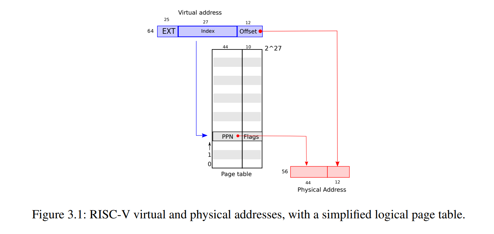
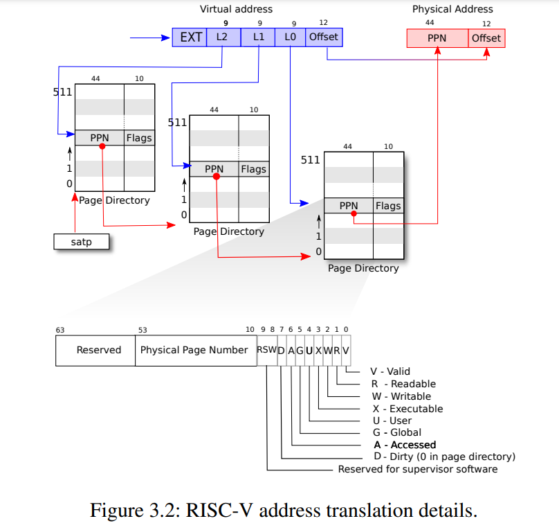
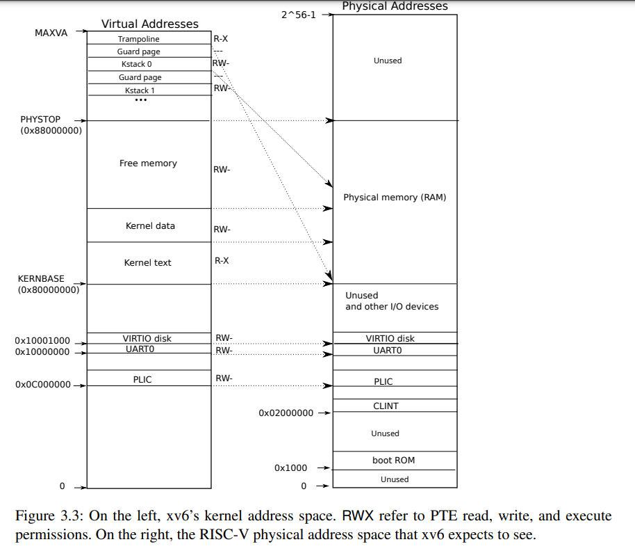
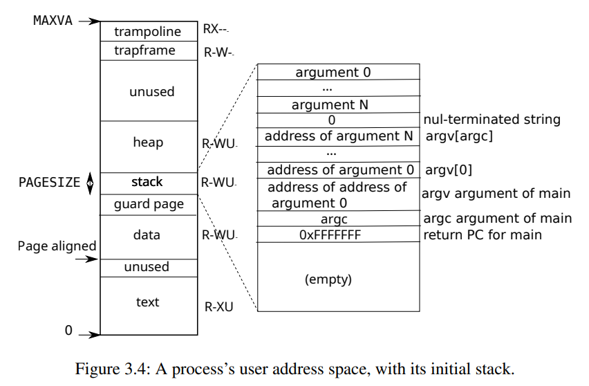

# Chapter 3

# 页表

页面表是操作系统向每个进程提供其独立的地址空间和内存的最常用机制。页面表确定内存地址的含义以及可以访问哪些物理内存的部分。它们允许xv6隔离不同进程的地址空间并将它们多路复用到单个物理内存中。页面表是一个流行的设计，因为它们提供了一个间接级别，使操作系统能够执行许多技巧。Xv6执行了一些技巧：将同一内存（一个跳板页面）映射到多个地址空间，并使用未映射的页面保护内核和用户堆栈。本章的其余部分将讲解RISC-V硬件提供的页面表以及xv6如何使用它们。

## 分页硬件
提醒一下，RISC-V指令（包括用户和内核）使用虚拟地址进行操作。机器的RAM，即物理内存，使用物理地址进行索引。RISC-V页面表硬件通过将每个虚拟地址映射到物理地址来连接这两种地址。


Xv6运行在Sv39 RISC-V架构上，这意味着仅使用64位虚拟地址的底部39位；前25位未使用。在这种Sv39配置下，RISC-V页面表在逻辑上是一个包含$2^{27}（134,217,728）$个页面表项（PTEs）的数组。每个PTE包含一个44位物理页面号（PPN）和一些标志位。分页硬件通过使用39位地址中的前27位索引页面表来查找PTE，然后创建一个56位的物理地址，其前44位来自PTE中的PPN，后12位复制自原始虚拟地址。图3.1以PTE的简单数组逻辑视图显示了此过程（完整的过程见图3.2）。页面表使操作系统能够在$4096（2^{12}）$字节对齐的块的粒度上控制虚拟地址到物理地址的转换。这种块称为\indextext{页面}。



在Sv39 RISC-V架构中，虚拟地址的前25位未用于转换。物理地址还有增长的空间：PTE格式中的物理页面号可以再增加10位。RISC-V设计者根据技术预测选择了这些数字。$2^{39}$字节是512 GB，应该足够应用程序在RISC-V计算机上运行的地址空间。$2^{56}$是足够的物理内存空间，以适应许多I/O设备和DRAM芯片的未来。如果需要更多空间，RISC-V设计者定义了Sv48架构，拥有48位虚拟地址。

如图3.2所示，RISC-V CPU将虚拟地址转换为物理地址有三个步骤。页面表存储在物理内存中，以三级树的形式存在。树的根是一个4096字节的页面表页面，包含512个PTE，其中包含下一级树中页面表页面的物理地址。每个页面都包含512个PTE，用于树的最后一级。分页硬件使用27位中的前9位来选择根页面表页面中的一个PTE，下一级树种页面表页面中的中间9位来选择一个PTE，下面9位来选择最后一个PTE。（在Sv48 RISC-V系统中，页面表具有四级结构，虚拟地址的第39到47位用于选择顶级页面表。）

如果用于转换地址的三个PTE中的任何一个不存在，则分页硬件会引发一个`page-fault`异常，将异常处理留给内核处理（见第4章）。

图3.2中的三级结构与图3.1 中的单级设计相比，允许以更为节省内存的方式记录PTE。在大部分虚拟地址范围内没有映射的常见情况下，三级结构可以省略整个页面目录。例如，如果一个应用程序仅使用从地址零开始的几个页面，则顶级页面目录的1到511条目是无效的，并且内核不必为这511个中间页面目录分配页面。此外，内核还不必为这511个中间页面目录的底层页面目录分配页面。因此，在这个例子中，三级设计为中间页面目录节省了511页，底层页面目录节省了$511 \times 512$页。

尽管CPU在执行加载或存储指令时会在硬件中遍历三级结构，但三级结构的一个潜在缺陷是CPU必须从内存加载三个PTE才能将加载/存储指令中的虚拟地址转换为物理地址。为了避免从物理内存中加载PTE的成本，RISC-V CPU会将页面表条目缓存到**page-fault**中。

每个PTE包含标志位，用于告知分页硬件关联的虚拟地址允许如何使用。`PTE_V`表示PTE是否存在：如果未设置，则对页面的引用会引发异常（即不允许引用）。`PTE_R`控制指令是否允许读取页面。`PTE_W`控制指令是否允许写入页面。`PTE_X`控制CPU是否可以将页面内容解释为指令并执行它们。`PTE_U控制是否允许用户模式下的指令访问页面；如果未设置`PTE_U，则PTE仅能在管理模式下使用。图3.2展示了所有这些如何工作。这些标志和所有其他与页面硬件相关的结构在(kernel/riscv.h)中定义。

为了让CPU使用页面表，内核必须将根页面表页面的物理地址写入`satp`寄存器。CPU将使用其自己的`satp`指向的页面表对后续指令生成的所有地址进行转换。每个CPU都有自己的`satp`，因此不同的CPU可以运行不同的进程，每个进程都有由其自己的页面表描述的私有地址空间。

通常，内核会将所有物理内存映射到其页面表中，以便可以使用加载/存储指令读取和写入物理内存中的任何位置。由于页面目录存储在物理内存中，内核可以通过使用标准的存储指令将PTE的内容编程到页面目录中的虚拟地址来同时编辑页面目录下的多个PTE。

几个术语的说明。物理内存指的是DRAM中的存储单元。一个物理内存字节具有地址，称为物理地址。指令仅使用虚拟地址，分页硬件将虚拟地址转换为物理地址，然后发送到DRAM硬件以读取或写入存储。与物理内存和虚拟地址不同，虚拟内存并不是物理对象，而是指内核提供的一系列抽象和机制，用于管理物理内存和虚拟地址。

## 内核地址空间


Xv6为每个进程维护一个页面表，描述每个进程的用户地址空间，另外还维护一个描述内核地址空间的单个页面表。内核配置其地址空间的布局，使其可以在可预测的虚拟地址下访问物理内存和各种硬件资源。图3.3 显示了该布局如何将内核虚拟地址映射到物理地址。文件 (kernel/memlayout.h) 声明了 xv6 内核内存布局常量。

QEMU 模拟一台计算机，包括从物理地址 `0x80000000` 开始的 RAM（物理内存），并继续通过至少 `0x88000000`，xv6 将其称为 `PHYSTOP`。QEMU 模拟还包括用于磁盘接口等 I/O 设备。QEMU 将设备接口作为低于物理地址空间中的 `0x80000000` 的 *内存映射*控制寄存器，暴露给软件。内核可以通过读取/写入这些特殊的物理地址与设备硬件通信，而不是与 RAM 通信。第4 章解释了 xv6 如何与设备互动。

内核通过“直接映射”来访问 RAM 和内存映射设备寄存器；即将资源映射到等于物理地址的虚拟地址。例如，内核本身位于虚拟地址空间和物理内存中的 `KERNBASE=0x80000000`。直接映射简化了读写物理内存的内核代码。例如，当 `fork` 为子进程分配用户内存时，分配器返回该内存的物理地址；在将父进程的用户内存复制到子进程时，`fork` 将该地址直接用作虚拟地址。

只有几个内核虚拟地址不是直接映射的：
- 第一个是跳转页面 (trampoline page) 。它位于虚拟地址空间的顶部; 用户页面表也具有相同的映射。在第4 章中，我们讨论了跳转页的作用，但是我们在这里可以看到页面表的一个有趣用例;将一个物理页面（包含跳转代码）映射两次到内核的虚拟地址空间中：一次在虚拟地址空间的顶部，一次直接映射。

- 第二个是内核堆栈页面。每个进程都有自己的内核堆栈，它被映射到较高的位置，以便 xv6 可以在其下留下一个未映射的*警戒页*(guard page)。警戒页的 PTE 无效（即，`PTE_V`没有设置），因此如果内核堆栈溢出，它可能会导致异常并造成内核停机。没有警戒页，溢出的堆栈会覆盖其他内核内存，导致操作不正确。内核停机崩溃是更好的选择。

虽然内核通过高内存映射使用它的堆栈，但它们也可以通过直接映射地址被内核访问。另一种设计可能只有直接映射，并使用直接映射地址上的堆栈。然而，在这种安排中，提供警戒页将涉及取消映射本应指向物理内存的虚拟地址，这将难以使用。

内核以`PTE_R`和`PTE_X`的权限来映射跳转页和内核文本页面。内核从这些页面读取并执行指令。内核使用`PTE_R`和`PTE_W`的权限映射其他页面，以便可以读取和写入这些页面中的内存。警戒页的映射是无效的。

## 代码:创建地址空间

大部分用于操作地址空间和页面表的 xv6 代码都位于 *vm.c* (kernel/vm.c:1) 中。中心数据结构是 `pagetable_t`，它实际上是指向 RISC-V 根页面表页的指针；`pagetable_t` 可以是内核页面表，也可以是每个进程的页面表之一。中心函数是 `walk`，它找到虚拟地址的 PTE，以及 `mappages`，它为新映射安装 PTE。以 `kvm` 开头的函数操作内核页面表；以 `uvm` 开头的函数操作用户页面表；其他函数同时用于两者。`copyout` 和 `copyin` 复制提供作为系统调用参数的用户虚拟地址的数据；它们位于 *vm.c* 中，因为需要显式地翻译这些地址，以便找到相应的物理内存。

在引导序列的早期阶段，`main` 调用 `kvminit` 以使用`kvmmake` 创建内核页面表。这个调用发生在 xv6 在 RISC-V 上启用分页之前，所以地址直接指向物理内存。`kvmmake` 首先分配一个物理内存页面用于存储根页面表页。然后调用 `kvmmap` 来安装内核需要的转换。这些转换包括内核的指令和数据、物理内存直到 `PHYSTOP`、以及实际上是设备的内存范围。`proc_mapstacks` 为每个进程分配一个内核堆栈。它调用 `kvmmap` 来将每个堆栈映射到由 `KSTACK` 生成的虚拟地址上，这为无效的堆栈保护页留下了空间。

`kvmmap`函数会调用`mappages`函数，该函数会将一个虚拟地址范围的所有地址映射为相应的物理地址。它会针对范围内的每个虚拟地址，按页的间隔单独执行映射。针对要映射的每个虚拟地址，`mappages`会调用`walk`来查找该地址的页表项（PTE）的地址。然后，它会初始化PTE，将相关的物理页编号、所需权限（`PTE_W`、`PTE_X`和/或`PTE_R`）和`PTE_V`标志赋值给PTE，用于标记该PTE为有效。

`walk`函数模拟了RISC-V分页硬件查找虚拟地址的过程（详见图3.2）。`walk`每次沿着3级页表下降9位。它使用每一级的9位虚拟地址来找到下一级页表或最终的页面对应的PTE。如果PTE无效，则表示尚未分配所需的页面；如果设置了`alloc`参数，则`walk`会分配一个新的页表页，并将其物理地址放入PTE。它将返回树中最低层PTE的地址。

上述代码依赖于物理内存直接映射到内核虚拟地址空间。例如，当`walk`下降页表级别时，它会获取（物理）地址，并使用该地址作为虚拟地址来获取下一级PTE。


`main`函数调用`kvminithart`函数来安装内核页表。它将根页表页的物理地址写入`satp`寄存器。此后，CPU将使用内核页表进行地址转换。由于内核使用身份映射，下一条指令的虚拟地址将映射到正确的物理内存地址。

每个RISC-V CPU会缓存页表项在*TLB*中，当xv6更改页表时，它必须告诉CPU使相应的缓存的TLB项无效。如果没有这么做，那么在稍后的某个时刻，TLB可能会使用旧的缓存映射，指向在此期间已分配给另一个进程的物理页面，结果会导致一个进程可能会写入到其他进程的内存。RISC-V有一条指令`sfence.vma`，可以刷新当前CPU的TLB。xv6在重新加载`satp`寄存器后，在`kvminithart`函数和在跳转代码中将切换到用户页表之前返回到用户空间中执行`sfence.vma`。

在更改`satp`之前也需要发出`sfence.vma`，以便等待所有未完成的load和store操作完成。这个等待确保对页表的前面的更新完成，并确保前面的load和store操作使用旧页表而不是新页表。

为了避免刷新整个TLB，RISC-V CPU可能支持地址空间标识符（ASIDs）。内核可以清除一个特定地址空间的TLB条目。xv6不使用此功能。

## 物理内存分配

内核必须在运行时为页表、用户内存、内核栈和管道缓冲区分配和释放物理内存。

xv6使用内核结束和`PHYSTOP`之间的物理内存进行运行时分配。它一次分配或释放整个4096字节大小的页面。它沿着页面本身将链表线程化以跟踪哪些页面是可用的。分配包括从链表中移除页面；释放包括将已释放页面添加到链表中。

## 代码:物理内存分配器

分配器位于`kalloc.c`中(kernel/kalloc.c:1)。 分配器的数据结构是一个空闲页的*空闲列表*，用于分配物理内存页。 每个空闲页的链表元素都是一个`struct run`。 分配器从哪里获取内存以容纳该数据结构呢？ 它将每个空闲页面的`run`结构存储在页面本身中，因为除此之外没有存储任何其他数据。 该空闲列表由一个自旋锁保护，该列表和锁都包装在一个结构体中，以明确锁保护该结构体中的字段。 暂时忽略锁和对`acquire`和`release`的调用；第6章将详细讨论加锁。

函数`main`会调用`kinit`来初始化分配器。`kinit`将空闲列表初始化为所有介于内核末尾和*PHYSTOP*之间的页面。xv6应该通过解析硬件提供的配置信息来确定有多少物理内存可用。但是，xv6假设机器有128兆字节的内存。`kinit`通过对`kfree`的每个页面单独内存调用，调用`freerange`将内存添加到空闲列表中。一个PTE只能引用按4096字节边界对齐（是4096的倍数）的物理地址，因此`freerange`使用`PGROUNDUP`确保仅释放对齐的物理地址。分配器最初没有内存；这些对`kfree`的调用给它一些可以管理的内存。

有时，分配器将地址视为整数以执行算术运算（例如，遍历`freerange`中的所有页面），有时则将地址用作指针以读取和写入内存（例如，操作存储在每个页面中的`run`结构）。这种对地址的双重使用是分配器代码中充斥着C类型转换代码的主要原因。另一个原因是释放和分配本质上会改变内存的类型。

函数`kfree`首先将释放的内存中的每个字节设置为值1。这将导致在释放内存后使用它（使用“悬空引用”）的代码读取垃圾而不是旧的有效内容。希望这将使这样的代码更快地崩溃。然后，`kfree`将页面添加到空闲列表的开头：它将`pa`强制转换为指向`struct run`的指针，在`r->next`中记录旧的空闲列表的开始位置，并将空闲列表设置为`r`。`kalloc`删除并返回空闲列表中的第一个元素。

## 进程地址空间
每个进程都有自己独立的页表，当xv6在进程之间切换时，也会切换对应的页表。图3.4比图2.3更详细地展示了一个进程的地址空间布局。进程的用户内存从虚拟地址0开始，并可扩展到最大虚拟地址`MAXVA`（理论上为256GB的内存容量）。

一个进程的地址空间由包含程序文本的页面（xv6使用权限`PTE_R`、`PTE_X`和`PTE_U`来映射），包含程序预初始化数据的页面，堆栈页面以及堆页面组成。 xv6使用权限`PTE_R`、`PTE_W`和`PTE_U`来映射数据、堆栈和堆。

在用户地址空间中使用权限是一种常见的技术，可以加强用户进程的安全性。 如果文本映射时带有权限`PTE_W`，那么进程可能会意外地修改自身程序。例如，编程错误可能导致程序写入空指针，从而修改0地址处的指令，然后继续运行，可能会造成更多麻烦。为了立即检测到此类错误，xv6使用不带`PTE_W`的方式映射文本；如果程序意外地尝试将存储器写入地址0，则硬件将拒绝执行并引发页错误（请参见第4.6节）。 然后，内核将终止该进程并打印有关问题的信息，以便开发人员追踪问题。

同样，通过使用不带`PTE_X`的方式映射数据，用户程序无法意外跳转到程序数据中的地址并从该地址开始执行。

在现实世界中，通过仔细设置权限来加强进程的安全性也有助于防御安全攻击。攻击者可能会向程序（例如Web服务器）提供精心构造的输入，以触发程序中的错误，希望将该错误转化为漏洞~。仔细设置权限以及其他技术，例如随机化用户地址空间的布局，使此类攻击更加困难。

堆栈只有一页，并且显示了由exec创建的初始内容。包含命令行参数的字符串以及指向它们的指针数组位于堆栈的最顶部。在其下方的是使程序可以从`main`开始的值，就像刚刚调用了函数`main(argc，argv)`一样。

为了检测用户堆栈是否溢出了分配的堆栈内存，xv6通过清除`PTE_U`标志在堆栈下方放置了一个不可访问的警戒页面。如果用户堆栈溢出并且进程尝试使用堆栈下方的地址，则由于警戒页面对于在用户模式下运行的程序是不可访问的，硬件将生成页故障异常。当用户堆栈溢出时，现实世界的操作系统可能会自动为其分配更多的内存。

当进程请求更多的用户内存时，xv6将增加进程的堆。 xv6首先使用`kalloc`分配物理页面。然后添加指向新物理页面的PTE到进程的页表中。 xv6在这些PTE中设置`PTE_W`、`PTE_R`、`PTE_U`和`PTE_V`标志。大多数进程不使用整个用户地址空间；xv6在未使用PTE中将`PTE_V`清零。

我们在这里看到了一些很好的页表使用示例。首先，不同进程的页表将用户地址转换为不同的物理内存页面，以便每个进程都有私有用户内存。其次，每个进程将其内存视为从零开始的连续虚拟地址，而进程的物理内存可以是不连续的。第三，内核在用户地址空间的顶部映射一个不带`PTE_U`的跳板代码页面，因此单个物理内存页面在所有地址空间中都会出现，但只能由内核使用。



## 代码:sbrk

`sbrk`是进程缩小或增长其内存的系统调用。该系统调用由函数`growproc`实现，`growproc`根据`n`的正负调用`uvmalloc`或`uvmdealloc`。 `uvmalloc`使用`kalloc`分配物理内存，并使用`mappages`向用户页表添加PTEs。 `uvmdealloc`调用`uvmunmap`，该函数使用`walk`查找PTEs并使用`kfree`释放它们引用的物理内存。

xv6使用进程的页表不仅告诉硬件如何映射用户虚拟地址，而且作为唯一记录分配给该进程的物理内存页面的记录。这就是为什么释放用户内存（在`uvmunmap`中）需要检查用户页表的原因。

## 代码:exec
`exec`是一个系统调用，它用从文件中读取的数据替换进程的用户地址空间，该文件称为二进制文件或可执行文件。二进制文件通常是编译器和链接器的输出，包含机器指令和程序数据。使用第8章的`namei`找到名为`path`的二进制文件，然后读取ELF头。 xv6二进制文件采用广泛使用的**ELF格式**，该格式定义在(kernel/elf.h)中。 ELF二进制文件包括一个ELF头，后跟一系列程序段头，`progvhdr`描述了必须加载到内存中的应用程序的部分； xv6程序有两个程序段头：一个用于指令，一个用于数据。

第一步是快速检查文件是否可能包含ELF二进制文件。 ELF二进制文件以四字节的“magic number”`0x7F`，`E`，`L`，`F`或`ELF_MAGIC`开始。如果ELF头具有正确的幻数，`exec`假定该二进制文件格式正确。

`exec`使用`proc_pagetable`分配没有用户映射的新页表，并使用`uvmalloc`为每个ELF段分配内存，并使用`loadseg`将每个段加载到内存中。`loadseg`使用`walkaddr`找到要写入ELF段的每个页面的分配内存的物理地址，并使用`readi`从文件中读取数据。

第一个使用`exec`创建的用户程序`/init`的程序段头如下所示：

```bash
# objdump -p user/_init

user/_init:     file format elf64-little

Program Header:
0x70000003 off    0x0000000000006bb0 vaddr 0x0000000000000000
                                       paddr 0x0000000000000000 align 2**0
         filesz 0x000000000000004a memsz 0x0000000000000000 flags r--
    LOAD off    0x0000000000001000 vaddr 0x0000000000000000
                                       paddr 0x0000000000000000 align 2**12
         filesz 0x0000000000001000 memsz 0x0000000000001000 flags r-x
    LOAD off    0x0000000000002000 vaddr 0x0000000000001000
                                       paddr 0x0000000000001000 align 2**12
         filesz 0x0000000000000010 memsz 0x0000000000000030 flags rw-
   STACK off    0x0000000000000000 vaddr 0x0000000000000000
                                       paddr 0x0000000000000000 align 2**4
         filesz 0x0000000000000000 memsz 0x0000000000000000 flags rw-

```

在这里我们看到，文本段应加载到内存中的虚拟地址0x0（没有写权限），从文件偏移量0x1000的内容中加载。我们还看到，应在地址0x1000处加载数据，该地址位于页面边界上，并且没有可执行权限。

程序段头的`filesz`可能小于`memsz`，表示它们之间的空白应该用零（用于C全局变量）而不是从文件中读取填充。 对于`/init`，数据`filesz`为0x10字节，`memsz`为0x30字节，因此`uvmalloc`分配足够的物理内存以容纳0x30字节，但仅从文件`/init`中读取0x10字节。

现在，`exec`分配并初始化用户栈。它仅分配一个栈页。 `exec`将每个参数字符串逐个复制到栈的顶部，在`ustack`中记录它们的指针。它在将要传递给`main`的`argv`列表的结尾处放置一个空指针。 `ustack`的前三个条目是伪返回程序计数器，`argc`和`argv`指针。

`exec`在栈页的下方放置一个无法访问的页面，以使尝试使用多个页面的程序发生故障。这个无法访问的页面还允许`exec`处理太大的参数。在这种情况下，`exec`用于将参数复制到栈的`copyout`函数注意到目标页面是不可访问的，并返回-1。

在准备新的内存镜像期间，如果`exec`检测到像无效程序段这样的错误，它将跳转到`bad`标签处，释放新镜像，并返回-1。`exec`必须等待确定系统调用将成功后再释放旧镜像：如果旧镜像已经不存在，则系统调用将无法返回-1。在`exec`中的唯一错误情况发生在镜像创建期间。一旦镜像完成，`exec`就可以承诺新页表并释放旧页表。

`exec`从ELF文件加载字节到指定的地址中。用户或进程可以在ELF文件中放置任意地址。因此，`exec`是有风险的，因为ELF文件中的地址可能意外或故意地引用内核。对于不谨慎的内核，后果可能从崩溃到恶意颠覆内核的隔离机制（即安全漏洞）不等。Xv6执行了许多检查以避免这些风险。例如，`if(ph.vaddr + ph.memsz < ph.vaddr)`检查总和是否会溢出64位整数。危险在于，用户可以构造一个具有指向用户选择的地址的`ph.vaddr`的ELF二进制文件，且`ph.memsz`足够大，使得总和溢出到0x1000，这看起来像是有效的值。在旧版本的xv6中，用户地址空间也包含内核（但不能在用户模式下读/写），用户可以选择对应于内核内存的地址，因此将从ELF二进制文件将数据复制到内核中。在RISC-V版本的xv6中，这不可能发生，因为内核有自己的独立页表；`loadseg`加载到进程的页表中，而不是内核的页表。

内核开发人员很容易忽略关键检查，实际的内核往往缺少检查，这些缺失可能会被用户程序利用以获取内核特权。很可能xv6不能完全验证提供给内核的用户级数据，因此恶意用户程序可能会利用这些漏洞来规避xv6的隔离。

## 实际情况

和大多数操作系统一样，xv6使用分页硬件进行内存保护和映射。大多数操作系统通过结合分页和页面错误异常（在第4章中讨论）比xv6更加精细地使用分页。

xv6简化了内核使用虚拟地址和物理地址的直接映射，以及假设物理RAM位于地址0x8000000处，内核希望在这里加载。这对QEMU可以工作，但在实际硬件上使用这种方法并不明智；实际硬件在不可预测的物理地址上放置RAM和设备，因此（例如）可能没有RAM在xv6期望存储内核的0x8000000地址上。更严肃的内核设计利用页表将任意硬件物理内存布局转换为可预测的内核虚拟地址布局。

RISC-V支持物理地址级别的保护，但xv6不使用该功能。

在内存很大的机器上，使用RISC-V支持的“超级页面”可能是有意义的。当物理内存较小时，使用小页面允许以细粒度进行分配和页面置换。例如，如果程序仅使用8千字节的内存，则为其提供整个4兆字节的超级页面物理内存是浪费的。在具有大量RAM的机器上使用大页面是有意义的，并且可能会减少页表操作的开销。

xv6内核缺乏类似于`malloc`的分配器，可以为小对象提供内存，这阻止了内核使用需要动态分配的复杂数据结构。一个更复杂的内核可能会分配许多不同大小的小块，而不是（如xv6中）只分配4096字节的块；真正的内核分配器需要处理小的和大的分配。

内存分配是一个永恒的热门话题，基本问题是有效利用有限内存并准备未知的未来请求~。如今，人们更关心速度而不是空间效率。

## 练习

1. 解析RISC-V的设备树以查找计算机拥有的物理内存量。 
2. 编写一个用户程序，通过调用`sbrk(1)`使其地址空间增加一个字节。运行该程序并调查调用`sbrk`之前和之后程序的页表。内核分配了多少空间？新内存的PTE包含什么？
3. 修改xv6以在内核中使用超级页面。
4. Unix实现`exec`传统上包括对shell脚本的特殊处理。如果要执行的文件以文本`#!`开头，则第一行将被视为运行解释文件的程序。例如，如果调用`exec`来运行`myprog arg1`，而`myprog`的第一行为`#!/interp`，则`exec`会带着命令行`/interp myprog arg1`运行`/interp`。在xv6中实现对该约定的支持。
5. 为内核实现地址空间布局随机化