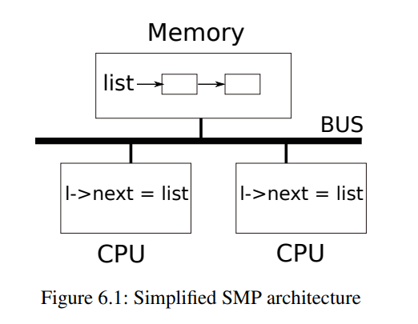
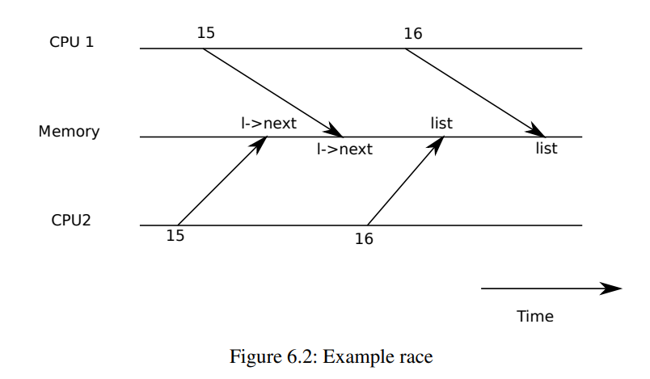

# Chapter 6

# 锁

大多数内核（包括xv6内核）都采用多个任务交替执行的方式。 其中一种交替的来源是多处理器硬件，即具有独立执行多个CPU的计算机，例如xv6内核的RISC-V。 这些多个CPU共享物理内存，xv6利用共享维护所有CPU都可以读写的数据结构。 这种共享会导致一个CPU在另一个CPU正在更新数据结构的中间部分读取该数据结构， 甚至多个CPU同时更新同一数据的情况也可能出现，如果不仔细设计这种并行访问， 很可能会产生错误的结果或导致数据结构破坏。 即使在单处理器上，内核也可能在多个线程之间切换CPU，从而使它们的执行被交替进行。 最后，设备中断处理程序可能会修改与某些可中断代码相同的数据，如果中断出现在恰当的时候， 则可能会损坏数据。 “并发性”的含义是指由于多处理器并行、线程切换或中断而导致多个指令流交替执行的情况。

内核中充满了同时访问的数据。例如，两个CPU可能同时调用`kalloc`， 从而同时从空闲列表的头部取出数据。内核设计师喜欢允许大量并发，因为它可以通过并行性提高性能和响应速度。 但是，作为结果，即使存在并发性，内核设计师也必须确信操作的正确性。 有许多方法可以获得正确的代码，其中一些更容易进行推理。旨在支持并发性控制的策略和抽象称为“并发控制技术”。

根据情况，xv6使用许多并发控制技术，但也有许多其他可能性。本章重点介绍一种广泛使用的技术：锁。 锁提供了互斥，确保一次只有一个CPU可以持有该锁。如果程序员将每个共享数据项与锁相关联，并且在使用该数据项时代码总是持有关联锁，则该数据项仅由一个CPU使用。 在这种情况下，我们说锁保护该数据项。尽管锁是一种容易理解的并发控制机制，但锁的缺点是它们可能限制性能，因为它们使并发操作序列化。

本章的其余部分解释了xv6为什么需要锁，xv6如何实现锁以及如何使用锁。

## 竞争



举个例子，我们来说明为什么需要锁：考虑两个进程在两个不同的CPU上调用`wait`等待子进程结束。`wait`函数会释放子进程的内存。因此，在每个CPU中，内核都会调用`kfree`函数来释放子进程的内存页面。内核的内存分配器会从空闲页面列表中维护一个链接的页面列表，`kfree()`会将这些页面返回给已经释放的空闲页面列表。为了获得最佳性能，我们希望这两个进程的`kfree`调用可以并行执行，而不需要等待对方，但是，鉴于xv6的`kfree`实现，这是不正确的。

图6.1更详细地说明了这种情况：空闲页面的链接列表在共享内存中，两个CPU使用“加载”和“存储”指令来操作列表。 (实际上，处理器具有缓存，但是在概念上，多处理器系统的行为就像单个共享内存系统。) 如果没有并发请求，那么您可以按以下方式实现链表的 `push` 操作：

```C
struct element {
      int data;
      struct element *next;
    };

    struct element *list = 0;

    void
    push(int data)
    {
      struct element *l;

      l = malloc(sizeof *l);
      l->data = data;
      l->next = list; 
      list = l;  
   }
```



这个实现在单独执行时是正确的。然而，如果有多个副本并发执行，则代码是不正确的。如果两个CPU同时执行`push`，则两者都可能在图6.1所示的第15行(`l->next = list;`)执行之前执行第16行(`l->next = list;`)，这将导致错误的结果，如图6.2所示。然后将会有两个`next` 都指向`list` 的前一个元素的值。当在第16行上对`list`的两次赋值发生时，第二次将覆盖第一次。已经存在于第一次赋值中的元素将被丢失。

第16行的丢失更新是典型的竞争情况。竞争指的是一种情况：在并发方式下，内存位置被访问，而且至少有一个访问是写入。竞争常常是 bug 的产生因素，无论是丢失更新（如果访问是写入）还是读取未完全更新的数据结构。竞争的结果取决于编译器生成的机器代码、两个 CPU 的时间安排，以及它们的内存操作在内存系统中的排序方式，这会让竞争引起的错误难以重现和调试。例如，在调试`push`时加入打印语句可能会改变执行的时间，使竞争消失。

避免竞争的一般方法是使用锁。锁确保互斥，使得同一时间只有一个 CPU 可以执行`push`的敏感行；这使得上述场景不可能发生。上述代码的正确锁定版本只需要添加几行代码（用黄色突出显示）：

```C
struct element *list = 0;
struct lock listlock;

void
push(int data)
{
  struct element *l;
  l = malloc(sizeof *l); (*@\label{line:malloc}@*)
  l->data = data;

  acquire(&listlock);
  l->next = list;     (*@\label{line:next1}@*)
  list = l;           (*@\label{line:list1}@*)
  release(&listlock};
}
```

`acquire`和`release`之间的指令序列通常称为临界区。锁通常被认为是在保护`list`。当我们说锁是用于保护数据时，实际上是指该锁保护一些适用于数据的某些不变性质。不变性质是指数据结构维护的跨操作的属性。通常，一个操作的正确行为取决于它开始时这些不变性质是否为真。操作可能会暂时违反这些不变性质，但必须在结束之前重新建立它们。例如，在链表中，不变性是`list`指向列表中的第一个元素，并且每个元素的`next`字段指向下一个元素。在`push`中，该实现暂时违反了这个不变性：在第17行(`l->next = list;`)，`l`指向下一个列表元素，但是此时`list`尚未指向`l`（在第18行重建）。我们上面所研究的竞争情况是由于第二个CPU在列表不变性中暂时违反时执行了依赖列表不变性的代码。锁的正确使用可以确保临界区中只有一个 CPU 对数据结构进行操作，以便在数据结构的不变性未被保持时不会执行任何CPU中的数据结构操作。

您可以将锁视为使并发的临界区串行化，以便它们按顺序运行，并因此维护不变性（假设临界区在单独执行时是正确的）。您还可以将由同一锁保护的临界区视为原子操作，因此每个临界区之间仅看到之前所有临界区的完整更改集，从未看到不完全完成的更新。

尽管锁对于正确性非常有用，但它们本质上会限制性能。例如，如果两个进程同时调用`kfree`，则锁将串行化这两个临界区，因此在不同的 CPU 上运行它们没有任何好处。如果多个进程同时争夺同一把锁，我们称之为多个进程发生竞争，或者称该锁经历了竞争。内核设计中的主要挑战之一是在追求并行性时避免锁的竞争。Xv6不做太多的优化，但是复杂的内核会专门组织数据结构和算法以避免锁的竞争。例如，在链表示例中，内核可以为每个 CPU 维护一个单独的空闲列表，仅当当前 CPU 的列表为空并且必须从另一个 CPU 中获取内存时，才会触及另一个 CPU 的空闲列表。其他用例可能需要更复杂的设计。

锁的位置对性能也很重要。例如，在`push`中，可以在第13行(`l = malloc(sizeof *l);`)之前将`acquire`移动，这是正确的。但是这可能会降低性能，因为此时`malloc`的调用会被串行化。下面的“使用锁”部分提供了一些有关何时插入`acquire`和`release`调用的指南。

## 代码:锁

Xv6有两种类型的锁：自旋锁和睡眠锁。我们先从自旋锁开始讲起。在Xv6中，自旋锁被表示为一个`struct spinlock`结构。该结构中的一个重要字段是`locked`，这是一个字，当锁可用时为零，当持有锁时为非零数。从逻辑上讲，Xv6应当通过执行代码来获取锁：

```
void
acquire(struct spinlock *lk) // does not work!
{
  for(;;) {
    if(lk->locked == 0) {  
      lk->locked = 1;      
      break;
    }
  }
}
```

不幸的是，这种实现在多处理器上不能保证互斥。 两个CPU可能同时到达第5行，看到 `lk->locked` 为零，然后通过执行第6行都抢到锁。这时，两个不同的CPU持有了锁，违反了互斥性质。我们需要的是一种方法，使第5和第6行可以作为一个原子步骤执行。

由于锁得到了广泛应用，多核处理器通常提供实现原子版本第5和第6行的指令。在RISC-V上，这条指令是`amoswap r, a`，`amoswap`读取内存地址`a`处的值，将寄存器`r`的内容写入该地址，并将它读取的值放入`r`。换句话说，它交换了寄存器和内存地址的内容。它使用特殊的硬件原子地执行此过程，以防止在读取和写入之间的其他CPU使用内存地址。

Xv6的`acquire`使用可移植的C库调用`__sync_lock_test_and_set`，它归结为`amoswap`指令。返回值是`lk->locked`的旧内容（已交换）。`acquire`函数在循环中封装了交换操作，重试（自旋）直到获取锁。每次迭代都会将1交换到`lk->locked`并检查前一个值；如果前一个值为0，则已获得锁，交换操作将设置`lk->locked`为1。如果前一个值为1，则表示某个其他CPU持有该锁，事实上交换操作原子地将1交换到`lk->locked`时没有改变它的值。

一旦获取了锁，`acquire`会记录获取锁的CPU以进行调试。`lk->cpu`字段受到锁的保护，必须在持有锁的同时才能更改。

函数`release`与`acquire`相反：它清除`lk->cpu`字段，然后释放锁，概念上，释放锁只需要将0赋值给`lk->locked`。C标准允许编译器使用多个存储指令来实现赋值，因此C赋值可能对并发代码是非原子的。相反，`release`使用C库函数`__sync_lock_release`来执行原子赋值。这个函数也归结为RISC-V的`amoswap`指令。

## 代码:使用锁

Xv6在许多地方使用锁来避免竞争条件。如上所述，`kalloc`和`kfree`构成了一个很好的例子。尝试练习1和2，看看如果这些函数省略了锁会发生什么。您可能会发现很难触发不正确的行为，这表明很难可靠地测试代码是否没有锁定错误和竞争条件。Xv6可能存在尚未发现的竞争条件。

使用锁的困难之一是决定使用多少锁以及每个锁应该保护哪些数据和不变量。有一些基本原则。首先，任何时候一个变量可以被一个CPU写入，同时另一个CPU可以读取或写入它，应该使用锁来防止两个操作重叠。第二，记住锁保护不变量：如果一个不变量涉及多个内存位置，通常所有这些位置都需要由一个锁来保护，以确保不变量得到维护。

以上规则说明了何时需要锁，但没有说明何时不需要锁，在效率上不过度锁定非常重要，因为锁定会减少并行性。如果并行性不重要，那么可以安排只有一个线程，不必担心锁。一个简单的内核可以在多处理器上通过具有单个锁来实现这一点，在进入内核时必须获取该锁，在退出内核时释放该锁（尽管阻塞系统调用如管道读取或`wait`会带来问题）。许多单处理器操作系统已经使用这种方法转换为在多处理器上运行，有时称为“大内核锁”，但这种方法牺牲了并行性：每次只能有一个CPU在内核中执行。如果内核进行任何重型计算，使用更大的、更细粒度的锁集合会更有效，这样内核就可以在多个CPU上同时执行。

作为粗粒度锁定的一个例子，xv6的`kalloc.c`分配器有一个单一的空闲列表，由一个单一的锁保护。如果不同CPU上的多个进程同时尝试分配页面，则每个进程都需要等待自己的回合，通过在acquire中自旋等待。自旋浪费CPU时间，因为它不是有用的工作。如果争夺锁的内容浪费了CPU时间的相当一部分，也许通过改变分配器设计来拥有多个自己的锁的空闲列表，以允许真正的并行分配，可以提高性能。

作为细粒度锁定的例子，xv6针对每个文件使用单独的锁，因此操作不同文件的进程通常可以在无需等待对方锁的情况下进行。如果想要允许进程同时写入同一文件的不同区域，则可以使文件锁定方案更加细粒度。最终，锁的粒度决策需要由性能测量和复杂性考虑来驱动。

随着后续章节对xv6的每个部分的解释，它们将提到xv6的使用锁来处理并发的示例。作为预览，图\ref{fig:locktable}列出了xv6中的所有锁。

| 锁                | 类型                     |
| ---------------- | ---------------------- |
| bcache.lock      | 保护块缓存分配                |
| cons.lock        | 串行化对控制台硬件的访问，避免输出混杂在一起 |
| ftable.lock      | 保护文件表中 struct 文件的分配    |
| itable.lock      | 保护内存中 inode 条目的分配      |
| vdisk\_lock      | 串行化对磁盘硬件和 DMA 描述符队列的访问 |
| kmem.lock        | 保护内存的分配                |
| log.lock         | 保护事务日志上的操作             |
| pipe's pi->lock  | 保护每个管道上的操作             |
| pid\_lock        | 串行化 next_pid 的增量       |
| proc's p->lock   | 串行化进程状态的更改             |
| wait\_lock       | 帮助等待避免丢失唤醒             |
| tickslock        | 保护 ticks 计数器上的操作       |
| inode's ip->lock | 保护每个 inode 及其内容上的操作    |
| buf's b->lock    | 保护每个块缓存上的操作            |
| Fig 6.3          | xv6中的锁                 |

## 死锁和锁顺序

如果内核中的一个代码路径必须同时持有几个锁，那么重要的是所有的代码路径都以相同的顺序获取这些锁。如果没有这样做，就会存在死锁的风险。例如，在xv6中有两个代码路径需要锁A和锁B，但是代码路径1按照A然后B的顺序获取锁，而另一个代码路径按照B然后A的顺序获取锁。假设线程T1执行代码路径1并获取锁A，线程T2执行代码路径2并获取锁B。接下来，T1会尝试获取锁B，而T2会尝试获取锁A。由于在这两种情况下，另一个线程持有所需的锁，并且不会在其获取返回之前释放它，因此两个获取都会无限期阻塞。为避免这种死锁，所有的代码路径都必须按照相同的顺序获取锁。全局锁获取顺序的需要意味着锁实际上是每个函数规范的一部分：调用者必须以一种使锁按照协商好的顺序获取的方式调用函数。

由于`sleep`的工作方式（见第7章），xv6中有许多长度为二的锁定链涉及每个进程锁（即每个`struct proc`中的锁）。例如，`consoleintr`是处理键入字符的中断例程。当新行到达时，任何等待console输入的进程都应该被唤醒。为了实现这一点，`consoleintr`在调用`wakeup`时持有`cons.lock`，后者按顺序获取等待进程的锁以唤醒它。因此，避免死锁的全局锁顺序包括规则：必须先获取`cons.lock`，然后再获取任何进程锁。文件系统代码包含了xv6最长的锁链。例如，创建一个文件需要同时持有目录上的锁、新文件inode上的锁、磁盘块缓冲区上的锁、磁盘驱动程序的`vdisk_lock`和调用进程的`p->lock`。为避免死锁，文件系统代码总是按照前面提到的顺序获取锁。

遵循全局避免死锁的顺序可能会令人惊讶地困难。有时锁的顺序与逻辑程序结构发生冲突，例如，可能代码模块M1调用模块M2，但是锁的顺序要求先获取M2中的锁，然后再获取M1中的锁。有时锁的身份事先不知道，例如，因为必须持有一个锁以便下一步接着获取下一个锁的身份，这种情况在文件系统中寻找路径名中的连续组件以及wait和exit的代码中出现，因为它们搜索进程表以查找子进程。最后，避免死锁的危险通常限制了锁定方案的粒度，因为更多的锁通常意味着更多的死锁机会。避免死锁的需要通常是内核实现的重要因素之一。

## 可重入锁

使用可重入锁(也称为递归锁)可能能够避免一些死锁和锁顺序挑战。如果进程持有锁且试图再次获取该锁，则内核可以直接允许这样做，而非在xv6内核中调用panic函数。

然而，实际上可重入锁使得并发性方面的推理变得更加困难：可重入锁打破了锁会使关键部分具有原子性的直觉。考虑以下两个函数f和g：

```C
struct spinlock lock;
int data = 0; // protected by lock

f() {
  acquire(&lock);
  if(data == 0){
    call_once();
    h();
    data = 1;
  }
  release(&lock);
}

g() {
  aquire(&lock);
  if(data == 0){
    call_once();
    data = 1;
  }
  release(&lock);
}
```

看这段代码片段，人们可能会认为`call_once`只会被f或者g中的一个函数调用，而不是两个函数都调用。

但是，如果允许可重入锁，并且h恰好调用了g，那么`call_once`将会被调用两次。

如果不允许可重入锁，那么h调用g将导致死锁，这也不太好。但是，假设调用`call_once`会造成严重错误，那么死锁是更可取的选择。内核开发人员将会注意到死锁（内核崩溃）并可以修复代码以避免它，而调用两次`call_once`可能会悄悄产生难以追踪的错误。

因此，xv6使用更简单易懂的非可重入锁。只要程序员牢记锁定规则即可让这两种方法都能正常工作。如果xv6使用可重入锁，则必须修改`acquire`函数以注意到该锁当前由调用线程持有。类似于接下来讨论的`push_off`一样，还必须为spinlock结构添加嵌套acquire计数。

## 锁和中断处理程序

一些xv6自旋锁保护的数据同时被线程和中断处理程序使用。例如，计时器中断处理程序`clockintr`可能会在内核线程在`sys_sleep`函数中读取`ticks`变量时增加`ticks`，这时`tickslock`锁将序列化这两个访问。

自旋锁和中断之间的交互引发了潜在的危险。假设`sys_sleep`持有`tickslock`，并且它所在的CPU被计时器中断打断。此时，`clockintr`将尝试获得`tickslock`，看到它被持有，然后等待其被释放。但是在此情况下，`tickslock`永远不会被释放：只有`sys_sleep`可以释放它，但是`sys_sleep`将不会继续运行，直到`clockintr`返回。因此，CPU将死锁，需要任何一个锁的代码也将停止运行。

为了避免这种情况，如果自旋锁被中断处理程序使用，则CPU不能启用中断并持有该锁。Xv6更加保守：当CPU获取任何一个锁时，xv6始终在该CPU上禁用中断。中断仍可能发生在其他CPU上，因此中断的`acquire`函数可以等待线程释放自旋锁；只是不能在同一CPU上等待。

当CPU没有持有自旋锁时，xv6会重新启用中断；它必须进行少量的簿记处理来应对嵌套临界段。`acquire`函数调用`push_off`函数，而`release`函数调用`pop_off`函数来跟踪当前CPU上锁的嵌套级别。当计数达到零时，`pop_off`函数将恢复最外层临界区开始时存在的中断使能状态。`intr_off`和`intr_on`函数分别执行RISC-V指令以禁用和启用中断。

重要的是，在设置`lk->locked`之前严格调用`acquire`函数中的`push_off`函数。如果颠倒这两个操作，那么在打开中断的情况下持有锁的短暂窗口期将导致不幸时机的中断导致系统死锁。同样地，重要的是，在释放锁之后才调用`release`函数中的`pop_off`函数，以避免死锁。

## 指令和内存排序

通常我们认为程序按照源代码语句的顺序执行。这是单线程代码的合理心理模型，但是当多个线程通过共享内存进行交互时，这种模型是错误的~。 其中一个原因是编译器发出的载入和存储指令的顺序与源代码所暗示的顺序不同，而且也可能完全省略它们（如通过在寄存器中缓存数据）。 另一个原因是为了提高性能，CPU 可能会乱序执行指令。例如，CPU 可能会注意到在一个串行的指令序列中，指令 A 和指令 B 之间彼此没有依赖。CPU 可能会先启动指令 B，这是因为它的输入在 A 的输入之前就已经准备好了，或者为了让 A 和 B 的执行时间部分重叠。

下面是一个糟糕的例子，说明了问题可能出在哪里。在这个 `push` 代码中，如果编译器或 CPU 将 `release` 所在的第 6 行之后的存储指令（即第 4 行）推迟到 `release` 之后执行，那就会造成灾难性后果：

```C
l = malloc(sizeof *l);
l->data = data;
acquire(&listlock);
l->next = list;   
list = l;     
release(&listlock); 
```

如果发生了这样的重排序，就会在另一个 CPU 获取锁并观察到更新后的 `list`，但是看到了一个未初始化的 `list->next` 的窗口期。

好消息是，编译器和 CPU 通过遵循一组称为内存模型的规则，并提供一些原语来帮助程序员控制重排序，来帮助并发编程人员。

为了告诉硬件和编译器不要重排序，xv6 在 `acquire` 和 `release` 中都使用了 `__sync_synchronize()`，而 `__sync_synchronize()` 则是一个内存屏障：它告诉编译器和 CPU 不要在屏障之间重排载入或存储操作。xv6 中的 `acquire` 和 `release` 中的内存屏障能够强制约束在许多重要情况下必须要遵守的顺序，因为 xv6 在访问共享数据时使用了锁。第9 章讨论了一些例外情况。

## 睡眠锁

有时 xv6 需要长时间持有锁。例如，文件系统（第8 章）在读写其内容时会锁定文件，而这些磁盘操作可能需要几十毫秒。长时间持有自旋锁会导致资源浪费，如果另一个进程想要获取该锁，则获取该锁的进程将浪费很长时间在自旋等待上。自旋锁的另一个缺点是，在保持自旋锁的同时，进程无法放弃 CPU，我们希望在保持锁等待磁盘时可以让其他进程使用 CPU。持有自旋锁时放弃 CPU 是不合法的，因为如果第二个线程尝试获取该自旋锁，则可能导致死锁；由于 `acquire` 不会放弃 CPU，第二个线程的自旋可能会阻止第一个线程运行并释放该锁。当持有锁时放弃 CPU 违反了自旋锁持有期间必须关闭中断的要求。因此，我们希望一种类型的锁，可以在等待获取锁时放弃 CPU，并允许在持有锁时放弃 CPU（和出现中断）。

xv6 通过 \indextext{睡眠锁} 提供了这样的锁。 `acquiresleep` 在等待时会放弃 CPU，具体的技术将在第7 章中解释。在高层次上，睡眠锁具有由自旋锁保护的 `locked` 字段，`acquiresleep` 中对 `sleep` 的调用原子化地放弃 CPU 并释放自旋锁。结果是在 `acquiresleep` 等待时，其他线程可以执行。

因为睡眠锁会使中断保持开启，所以不能在中断处理程序中使用。因为 `acquiresleep` 可能会放弃 CPU，所以不能在自旋锁临界区内使用睡眠锁（虽然可以在睡眠锁临界区内使用自旋锁）。

自旋锁最适合短临界区，因为等待自旋锁会浪费 CPU 时间；睡眠锁适用于长时间操作。

## 实际情况

尽管并发原语和并行计算已经有了多年的研究，使用锁编程仍然具有挑战性。尽可能将锁隐藏在更高级别的构造中，例如同步队列中，通常是最好的方式，尽管 xv6 并没有这样做。如果您使用锁编程，最好使用一种工具来识别竞争条件，因为会很容易忽略需要锁定的不变条件。

大多数操作系统都支持 POSIX 线程（Pthreads），它允许用户进程在不同的 CPU 上并发运行多个线程。Pthreads 特别支持用户级锁、屏障等。Pthreads 还允许程序员可选地指定一个锁应该是可重入的。

支持用户级别的 Pthreads 需要操作系统的支持。例如，如果一个 pthread 在系统调用中被阻塞，那么同一进程的另一个 pthread 必须能够在该 CPU 上运行。另一个例子，如果一个 pthread 改变了其进程的地址空间（例如，映射或取消映射内存），内核必须安排运行同一进程线程的其他 CPU 更新它们的硬件页表，以反映地址空间中的变化。

没有原子指令的情况下也可以实现锁~，但这是昂贵的，大多数操作系统使用原子指令。

如果许多 CPU 尝试同时获取相同的锁，则锁可能会很昂贵。如果一个 CPU 在它的本地缓存中缓存了一个锁，而另一个 CPU 必须获取该锁，则用于更新存有锁的缓存行的原子指令必须将该行从一个 CPU 的缓存移动到另一个 CPU 的缓存，并且可能会使缓存行的任何其他副本无效。从另一个 CPU 的缓存中获取缓存行的成本可能比从本地缓存中获取成本高几个数量级。

为避免与锁相关的费用，许多操作系统使用无锁的数据结构和算法~。例如，可以实现一个类似章节开头的链表，即在列表搜索期间不需要锁定，而只需一个原子指令即可在列表中插入一个项。然而，无锁编程比编程锁更加复杂，例如，您必须担心指令和内存重排序。使用锁编程已经很难，因此 xv6 避免了无锁编程的额外复杂性。

## 练习


1. 在 `kalloc` 中注释掉调用 `acquire` 和 `release` 的语句。这似乎会对调用 `kalloc` 的内核代码造成问题。您预期会看到哪些症状？当您运行 xv6 时，是否看到了这些症状？运行 `usertests` 时呢？如果您没有看到问题，为什么？尝试通过在 `kalloc` 的临界段中插入虚假循环来引发问题。
2. 假设您反而在 `kfree` 中注释掉了锁定（在 `kalloc` 中恢复锁定后）。现在可能会出现什么问题？缺少 `kfree` 中的锁比缺少 `kalloc` 中的锁更不利吗？
3. 如果两个 CPU 同时调用 `kalloc`，一个 CPU 将不得不等待另一个 CPU，这对性能很不利。修改 `kalloc.c` 以具有更多的并行性，以便可以同时处理来自不同 CPU 的 `kalloc` 调用，而不必等待彼此。
4. 使用 POSIX 线程编写并行程序，POSIX 线程是大多数操作系统都支持的。例如，实现一个并行哈希表，并测量在增加内核数的同时是否扩展了put/gets的数量。
5. 在 xv6 中实现 Pthreads 的子集。也就是说，实现一个用户级线程库，以便用户进程可以拥有多个线程，并安排这些线程在不同的 CPU 上并行运行。提出一种设计，正确处理线程进行阻塞系统调用并更改其共享地址空间的情况。