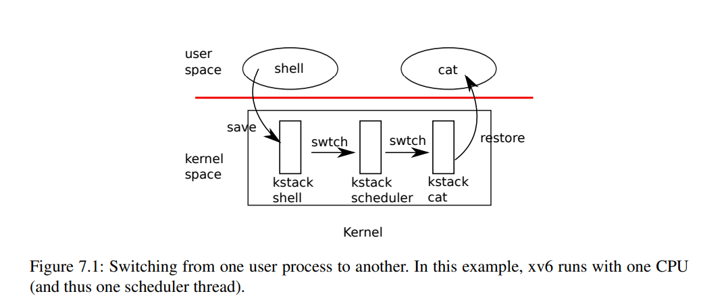

# Chapter 7

# 调度器

任何操作系统都可能比计算机的CPU更多地运行进程，因此需要计划如何在进程之间实现时间共享CPU。理想情况下，共享应该对用户进程透明。一种常见的方法是通过将进程多路复用到硬件CPU上，并使每个进程有自己的虚拟CPU的错觉。本章将解释xv6是如何实现这种多路复用的。

## 多路复用

在两种情况下，xv6通过将CPU从一个进程切换到另一个进程来实现多路复用。首先，xv6的`sleep`和`wakeup`机制会在进程等待设备或管道I/O完成、等待子进程退出或在`sleep`系统调用中等待时切换。其次，xv6定期强制切换以处理长时间计算而没有休眠的进程。这种多路复用创建了这样的错觉：每个进程都有自己的CPU，就像xv6使用内存分配器和硬件页表创建了这样一个错觉：每个进程都有自己的内存一样。

实现多路复用会遇到一些挑战。首先，如何从一个进程切换到另一个进程？虽然上下文切换的思想很简单，但实现是xv6中最难理解的代码之一。其次，如何以对用户进程透明的方式强制切换？xv6使用了标准技术，即硬件定时器中断来驱动上下文切换。第三，所有的CPU都会在相同的进程集之间切换，因此需要一个锁定计划来避免竞争。第四，当进程退出时，必须释放该进程的内存和其他资源，但该进程不能自行完成所有操作，因为例如，当它仍在使用内核栈时，它不能释放自己的内核栈。第五，多核机器的每个核都必须记住它正在执行的进程，以便系统调用会影响正确的进程的内核状态。最后，`sleep`和`wakeup`允许进程放弃CPU并等待被其他进程或中断唤醒。需要注意避免竞争，导致唤醒通知的丢失。xv6试图尽可能简单地解决这些问题，但结果代码仍然很复杂。

## 代码:上下文切换



图7.1概述了从一个用户进程切换到另一个用户进程所涉及的步骤：一个用户级-内核级转换（系统调用或中断）到旧进程的内核线程，一个上下文切换到当前CPU的调度程序线程，一个上下文切换到新进程的内核线程，并从陷阱返回到用户级进程。xv6调度程序每个CPU都有一个专用的线程（保存寄存器和堆栈），因为在旧进程的内核栈上执行调度程序是不安全的：其他核心可能唤醒该进程并运行该进程，如果在两个不同的核心上使用相同的栈将是一场灾难。

本节中，我们将介绍从内核线程切换到调度线程的机制。

从一个线程切换到另一个线程需要保存旧线程的CPU寄存器，并且恢复先前保存的新线程的寄存器。事实上，栈指针和程序计数器的保存和恢复意味着CPU将切换栈并切换执行的代码。

函数`swtch` 执行内核线程切换的保存和恢复操作。`swtch` 不直接知道线程，它只是保存和恢复一组32个RISC-V寄存器，称为`contexts`。当进程需要放弃CPU时，进程的内核线程调用 `swtch`来保存自己的 上下文并返回到先前保存的调度器上下文。每个上下文包含在一个进程的`struct proc`或一个CPU的`struct cpu`中的`struct context`中。 `swtch`接受两个参数:`struct context` `old` 和`struct context` `new`，它将当前的寄存器保存到`old`，从`new`加载寄存器，并返回。

让我们跟随一个进程通过`swtch`进入调度器的过程。我们在第4章中看到，在中断结束时的一个可能性是`usertrap`调用`yield`。 `yield` 反过来又调用 `sched`， `swtch` 将把当前上下文保存到`p->context`中 并切换到先前保存在`cpu->context`中的调度器上下文中(kernel/proc.c:497)。

`swtch`仅保存被调用者保留的寄存器; C编译器在调用程序中生成代码，将调用者保留的寄存器保存到堆栈中。 `swtch`知道每个寄存器字段在`struct context`中的偏移量。它不保存程序计数器，而是保存`ra`寄存器，该寄存器保存调用`swtch`的返回地址。现在，`swtch`从新上下文中恢复寄存器值，该值由先前的`swtch`保存。当`swtch`返回时，它返回到由恢复的`ra`寄存器指向的指令，也就是新线程之前调用`swtch`的指令。此外，它在新线程的栈上返回，因为恢复的 `sp`指向那里。

在我们的例子中, `sched`调用`swtch`以切换到`cpu->context`，即每个CPU的调度器上下文。该上下文在过去的某个点上保存了`scheduler` 调用`swtch`切换到正在放弃CPU的进程时。 当我们跟踪的`swtch`返回时，它并不返回`sched`，而是返回到`scheduler`，并使用当前CPU的调度器栈中的栈指针。

## 代码:调度器

上一节介绍了`swtch`的底层细节，现在我们假定`swtch`已经存在并且来看一下从一个进程的内核线程通过调度器切换到另一个进程的过程。调度器的存在形式是每个CPU上一个特殊的线程，每个线程都运行`scheduler`函数。该函数负责选择下一个要运行的进程。一个想要放弃CPU的进程必须获取自己的进程锁`p->lock`、释放任何其他锁、更新自己的状态(`p->state`)，然后调用`sched`。你可以在`yield`、`sleep`和`exit`中看到这个顺序。 `sched`会再次检查其中的一些要求，然后检查一个暗示: 由于锁被持有，中断应该被禁止。最后，`sched`调用`swtch`在`p->context`中保存当前上下文并切换到调度器上下文在`cpu->context`中。`swtch`会在调度器的堆栈上返回，接着调度器会继续执行它的`for`循环，找到要运行的进程并切换到该进程，然后循环再次开始。

我们刚刚看到xv6在调用`swtch`时需要持有`p->lock`，调用`swtch`的调用程序必须已经持有锁，并将锁的控制权传递给切换的代码。这种约定对于锁来说是不寻常的，通常获得锁的线程也负责释放锁，这使得关于正确性的推理更加容易。但是在上下文切换中，为了保护进程的`state`和`context`字段上的不变性，需要打破这种约定，这些不变性在`swtch`执行时是不成立的。如果没有在`swtch`中持有`p->lock`，可能会出现的一个问题是: 另一个CPU可能在`yield`将其状态设置为`RUNNABLE`之后却在`swtch`导致它停止使用自己的内核堆栈之前决定运行该进程。结果就是两个CPU在同一个堆栈上运行，这会引起混乱。

内核线程放弃CPU的唯一方式是在`sched`中，在`scheduler`中始终切换到相同的位置，该位置(几乎)总是切换到之前调用`sched`的某个内核线程。因此，如果我们打印xv6在哪些行切换线程，将观察到以下简单模式:依此类推。通过线程切换有意相互传递控制的过程有时称为协程(coroutines)。在这个例子中，`sched`和`scheduler`是彼此的协程。

只有一种情况，调度器对`swtch`的调用不会最终到达`sched`。`allocproc`将新进程的上下文`ra`寄存器设置为`forkret`，以便它的第一个`swtch` "返回"到该函数的开头。`forkret`的存在是为了释放`p->lock`，否则，由于新进程需要返回到用户空间，就像从`fork`返回一样，它可能会在`usertrapret`开始。

`scheduler`运行一个循环:找到要运行的进程，运行它直到它放弃CPU，然后重复该循环。调度器遍历进程表，寻找一个可运行的进程，即一个`p->state`等于`RUNNABLE`的进程。一旦它找到了一个进程，它设置每个CPU的当前进程变量`c->proc`，将该进程标记为`RUNNING`，然后调用`swtch`开始运行它。

思考调度代码的结构的一种方法是它会强制执行有关每个进程的一组不变性，并且只有在不变性成立时才持有`p->lock`。其中一个不变性是如果一个进程处于`RUNNING`状态，计时器中断的`yield`必须能够安全地切换到该进程以外。这意味着CPU寄存器必须保存进程的寄存器值(即 `swtch` 没有将它们移动到上下文中)，并且`c->proc`必须引用该进程。另一个不变性是如果一个进程处于`RUNNABLE`状态，空闲CPU的`scheduler`可以安全地运行该进程。这意味着`p->context`必须保存进程的寄存器(即它们实际上不在真实的寄存器中)，没有CPU在执行进程的内核堆栈上，并且没有任何CPU的`c->proc`引用该进程。注意这些属性在持有`p->lock`的同时通常是不成立的。

维护上述不变性是xv6经常在一个线程中获取`p->lock`并在另一个线程中释放锁的原因，例如在`yield`中获取，然后在`scheduler`中释放。一旦`yield`开始修改运行进程的状态以使其成为`RUNNABLE`状态，锁必须一直持有直到不变性被还原: 最早的正确释放点是在`scheduler` (在它自己的堆栈上运行)将`c->proc`清除后。同样，一旦`scheduler`开始将`RUNNABLE`进程转换为`RUNNING`，锁不能被释放，直到内核线程完全运行(例如在`yield`中的`swtch`之后)。

## 代码:mycpu 和 myproc

在多处理器的情况下，Xv6（一个操作系统）通常需要指向当前进程 `proc` 结构的指针。在单处理器上，可以有一个指向当前 `proc` 的全局变量。 但是，在多核机器上这并行不通，因为每个核心都执行不同的进程。解决这个问题的方法是利用每个核心都有自己的一组寄存器这个事实。我们可以使用其中一个寄存器来帮助找到每个核心的信息。

Xv6为每个CPU维护一个 `struct cpu` 的结构，记录了当前正在运行的进程（如果有的话）、CPU的调度器线程的保存寄存器以及管理中断禁用所需的嵌套自旋锁的计数。函数 `mycpu` 返回指向当前CPU的 `struct cpu` 的指针。RISC-V 对它的 CPU 进行编号，给每个 CPU 一个 hartid。Xv6 确保将每个 CPU 的 hartid 存储在该 CPU 的 `tp` 寄存器中，而在内核中。这允许 `mycpu` 使用 `tp` 来索引一个 `cpu` 结构的数组以找到正确的那个。

确保 CPU 的 `tp` 永远持有 CPU 的 hartid 是有点复杂的。 `start` 在 CPU 的引导序列早期设置了 `tp` 寄存器，而仍然在机器模式下。当用户进程可能修改 `tp` 时， `usertrapret` 将 `tp` 保存在跳板页面中。 最后，`uservec` 在从用户空间进入内核时恢复该保存的 `tp` 寄存器。编译器保证不会使用 `tp` 寄存器。如果 Xv6 随时需要，可以向 RISC-V 硬件询问当前 hartid ，但这只允许在机器模式下，而不是在监管模式下。

`cpuid` 和 `mycpu` 的返回值是脆弱的：如果定时器中断并导致线程产生切换而移动到另一个 CPU，则之前返回的值将不再正确。为了避免这个问题，Xv6 要求调用者在使用返回的 `struct cpu` 之前禁用中断，并且在完成后才启用中断。

函数 `myproc` 返回正在当前 CPU 上运行的进程的 `struct proc` 指针。 `myproc` 禁用中断，调用 `mycpu`，从 `struct cpu` 中获取当前进程指针（`c->proc`），然后启用中断。即使启用了中断，`myproc` 的返回值也是安全的：如果定时器中断将调用进程移动到不同的 CPU，则其 `struct proc` 指针仍将保持不变。

## 休眠和唤醒

调度和锁可以帮助屏蔽一个线程的操作对另一个线程的影响，但我们还需要抽象来帮助线程之间进行有意的交互。例如，在 xv6 中，读取管道的线程可能需要等待写入进程生成数据；父进程调用 `wait` 可能需要等待子进程退出；读取磁盘的进程需要等待磁盘硬件完成读取。在这些情况下（以及许多其他情况下），xv6 内核使用一种称为“休眠”（sleep）和“唤醒”（wakeup）的机制。休眠允许内核线程等待特定事件；另一个线程可以调用 wakeup 来指示等待事件的线程应该继续执行。休眠和唤醒通常被称为顺序协调或条件同步机制。

休眠和唤醒提供了相对较低级别的同步接口。为了激励它们在 xv6 中的使用，我们将使用它们来构建一个更高级别的同步机制，称为**信号量**，用于协调生产者和消费者（xv6 并不使用信号量）。信号量维护一个计数，并提供两个操作。对于生产者而言，“V”操作会将计数增加1。对于消费者而言，“P”操作会等待直到计数非零，然后将计数减1并返回。如果只有一个生产者线程和一个消费者线程，并且它们在不同的 CPU 上执行，并且编译器没有过于激进的优化，那么这种实现是正确的：
```C
struct semaphore {
    struct spinlock lock;
    int count;
};

void
V(struct semaphore *s)
{
   acquire(&s->lock);
   s->count += 1;
   release(&s->lock);
}
void
P(struct semaphore *s)
{
   while(s->count == 0)
     ;
   acquire(&s->lock);
   s->count -= 1;
   release(&s->lock);
}
```


上面的实现较为低效。如果生产者很少活动，消费者将会大部分时间在 `while` 循环中旋转，希望计数非零。与其忙等待，消费者的 CPU 可能会找到更有生产力的工作，通过重复轮询 `s->count` 来实现。避免忙等待需要一种方法，让消费者可以让出 CPU 并在 `V` 增加计数后恢复执行。

下面是朝着这个方向迈出的一步，但是正如我们所看到的，它还不够。让我们想象一对调用，`sleep` 和 `wakeup`，其工作如下。 `sleep(chan)` 等待任意值 `chan`（称为等待通道）。 `sleep` 会让调用进程进入睡眠状态，释放 CPU 以进行其他工作。 `wakeup(chan)` 觉醒正在等待 `chan`（如果有的话）的所有进程，导致它们的 `sleep` 调用返回。如果没有进程正在等待 `chan`，则 `wakeup` 不起作用。我们可以修改信号量的实现以使用 `sleep` 和 `wakeup`（突出显示黄色的更改）：
```C
void
V(struct semaphore *s)
{
   acquire(&s->lock);
   s->count += 1;
   (*@\hl{wakeup(s);}@*)
   release(&s->lock);
}

void
P(struct semaphore *s)
{
  while(s->count == 0)    (*@\label{line:test}@*)
    (*@\hl{sleep(s);}@*)  (*@\label{line:sleep}@*)
  acquire(&s->lock);
  s->count -= 1;
  release(&s->lock);
}
```

现在，`p` 放弃 CPU 而不是旋转，这非常好。不过，通过这种接口设计 `sleep` 和 `wakeup`，而不会遭受所谓的 *丢失唤醒*（lost wake-up）问题，其实并不容易。 假设 `p` 在第13 行找到了 `s->count == 0`。当 `p` 在第13 和第14 行之间时，`V` 在另一个 CPU 上执行： 它将 `s->count` 更改为非零并调用 `wakeup`，但没有发现任何正在等待的进程，因此不执行任何操作。 现在 `p` 继续执行第14 行：它调用 `sleep` 并进入睡眠状态。这会产生一个问题：`p` 正在等待已经发生的 `V` 调用，除非我们很幸运并且生产者再次调用 `V`，否则消费者将永远等待，即使计数为非零也是如此。

这个问题的根源是，`p` 只在 `s->count == 0` 时才休眠的不变量在不恰当的时刻被 `V` 运行违反。保护不变量的一种不正确的方式是将锁获取（突出显示黄色）移到 `p` 中，以使其对计数的检查和 `sleep` 的调用成为原子操作：
```C
void
V(struct semaphore *s)
{
  acquire(&s->lock);
  s->count += 1;
  wakeup(s);
  release(&s->lock);
}

void
P(struct semaphore *s)
{
  acquire(&s->lock);
  while(s->count == 0)    (*@\label{line:test1}@*)
    sleep(s);             (*@\label{line:sleep1}@*)
  s->count -= 1;
  release(&s->lock);
}
```

人们可能希望这个版本的 `p` 可以避免丢失唤醒，因为锁在第14 行和第15 行之间防止了 `V` 的执行。它确实可以避免丢失唤醒，但它也会死锁：`p` 在休眠时持有锁，因此 `V` 将永远阻塞等待锁。

我们将通过更改 `sleep` 的接口来修复上述方案：调用者必须将*条件锁*传递给 `sleep`，以便在将该进程标记为休眠且等待 `sleep` 信道时，`sleep` 可以释放锁。锁将强制并发的 `V` 等待，直到 `p` 已经将自己休眠，这样 `wakeup` 将找到正在休眠的消费者并将其唤醒。一旦消费者再次唤醒，`sleep` 在返回之前重新获取锁。

我们的新的正确的睡眠/唤醒方案的使用方法如下（突出显示黄色的更改）：

```C
void
V(struct semaphore *s)
{
  acquire(&s->lock);
  s->count += 1;
  wakeup(s);
  release(&s->lock);
}
void
P(struct semaphore *s)
{
  acquire(&s->lock);
  while(s->count == 0)
     sleep(s, &s->lock);
  s->count -= 1;
  release(&s->lock);
}
```

事实上，`p` 持有的 `s -> lock` 可以防止 `V` 在 `p` 检查 `s->count` 和调用 `sleep` 之间尝试唤醒它。但需要注意的是，为了避免丢失唤醒，我们需要 `sleep` 原子地释放 `s->lock` 并将消费进程置于睡眠状态。

## 代码:休眠和唤醒

Xv6 的 `sleep` 和 `wakeup` 提供了上述最后一个例子中所示的接口，它们的实现方法（以及如何使用它们的规则）确保不存在丢失唤醒现象。其基本思想是让 `sleep` 将当前进程标记为 `SLEEPING`，然后调用 `sched` 以释放 CPU；`wakeup` 查找正在给定等待信道上休眠的进程，并将其标记为 `RUNNABLE`。`sleep` 和 `wakeup` 的调用方可以使用任意方便的互联号作为信道。Xv6 经常使用涉及等待的内核数据结构的地址。

`sleep` 获取 `p->lock`。现在，休眠进程同时持有 `p->lock` 和 `lk`。在调用者（在例子中为 `p`）中持有 `lk` 是必要的：它确保没有其他进程（在例子中运行 `V` 的进程）能够开始调用 `wakeup(chan)`。现在 `sleep` 持有 `p->lock`，因此可以安全地释放 `lk`：某个其他进程可以开始调用 `wakeup(chan)`，但 `wakeup` 将等待获取 `p->lock`，因此会一直等待，直到 `sleep` 完成将该进程置于睡眠状态，从而避免了 `wakeup` 错过 `sleep`。

现在，`sleep` 持有 `p->lock` 且没有其他锁，可通过记录睡眠信道、将该进程的状态更改为 `SLEEPING` 并调用 `sched` 将该进程置于睡眠状态。很快就会清楚为什么关键是在标记该进程为 `SLEEPING` 之后，不要在 `scheduler` 之前释放 `p->lock`。

在某些时候，进程将获取条件锁，设置正在等待的休眠进程的条件，并调用 `wakeup(chan)`。重要的是在持有条件锁的情况下调用 `wakeup`。`wakeup` 循环访问进程表。它获取每个待检查进程的 `p->lock`，既因为它可能会操作该进程的状态，也因为 `p->lock` 确保 `sleep` 和 `wakeup` 不会错过对方。 当 `wakeup` 发现处于 `SLEEPING` 状态且具有匹配 `chan` 的进程时，它将更改该进程的状态为 `RUNNABLE`。调度程序下次运行时，它将看到该进程已经可以运行了。

为什么 `sleep` 和 `wakeup` 的锁定规则能够确保睡眠进程不会错过唤醒？ 睡眠进程在检查条件之前从一个点开始持有 条件锁或自己的 `p->lock` 或两者都持有，直到标记为 `SLEEPING` 之后。 调用 `wakeup` 的进程在 `wakeup` 的循环中 持有这两个锁。 因此，唤醒者要么在消费线程检查条件之前使条件为真； 要么唤醒者的 `wakeup` 会严格检查已经标记为 `SLEEPING` 的睡眠进程。 然后， `wakeup` 将看到睡眠进程并唤醒它 （除非有其他进程在此之前唤醒了它）。

有时会出现多个进程在同一信道上睡眠的情况； 例如，从管道中读取数据时可能有多个进程。 单个调用 `wakeup` 会唤醒它们所有的睡眠进程。 其中一个将首先运行并获取 `sleep` 调用时使用的锁，并在此之后（对于管道）读取等待在管道中的数据。 其他进程将发现，尽管它们被唤醒了，但没有数据可读。 从它们的角度来看，唤醒是“虚假的”，它们必须再次睡眠。 因此，`sleep` 总是在一个检查条件的循环中调用。

如果两个 sleep/wakeup 的使用意外地选择了相同的信道，那么不会发生任何伤害：它们将看到虚假的唤醒，但像上面描述的那样循环将容忍此问题。 sleep/wakeup 的很多优点在于它既轻量级（不需要创建特殊数据结构作为睡眠信道），又提供了一个间接层（调用者不需要知道它们正在与哪个具体进程交互）。

## 代码:管道

一个更复杂的示例是 xv6 实现管道时使用了 `sleep` 和 `wakeup` 来同步生产者和消费者。我们在第 1 章中看到了管道的接口：数据被写入管道的一端，并被复制到内核缓冲区，然后可以从管道的另一端读取。未来的章节将探讨围绕管道的文件描述符支持，但现在让我们来看看 `pipewrite` 和 `piperead` 的实现。

每个管道都由一个 `struct pipe` 表示，其中包含一个 `lock` 和一个 `data` 缓冲区。字段 `nread` 和 `nwrite` 分别统计了缓冲区中读和写的总字节数。缓冲区会循环：在 `buf[PIPESIZE-1]` 后写入的下一个字节是 `buf[0]`。计数器不会循环。这个约定使得实现可以区分满缓冲区（`nwrite` `==` `nread+PIPESIZE`）和空缓冲区（`nwrite` `==` `nread`），但它也意味着索引缓冲区必须使用 `buf[nread` `%` `PIPESIZE]` 而不是只使用 `buf[nread]`（对于 `nwrite` 也是如此）。

假设对 `piperead` 和 `pipewrite` 的调用同时发生在两个不同的 CPU 上。 `pipewrite` 首先获取管道锁，这个锁保护着计数器、数据及其相关的不变量。接着，`piperead` 也试图获取锁，但它不能获取，就在 `acquire` 中循环等待该锁。当 `piperead` 等待时，`pipewrite` 在循环中遍历被写入的字节（`addr[0..n-1]`），逐个将它们添加到管道中。在此循环期间，缓冲区可能已满。在这种情况下，`pipewrite` 调用 `wakeup`，通知任何正在等待读取的进程有数据在缓冲区中等待，然后睡在 `&pi->nwrite` 上等待读者从缓冲区中取出一些字节。 `sleep` 释放 `pi->lock`，让 `pipewrite` 的进程可以进入睡眠状态。

现在 `pi->lock` 可用了，`piperead` 成功获取了它并进入了其临界区：它发现 `pi->nread` `!=` `pi->nwrite`（`pipewrite` 因为 `pi->nwrite` `==` `pi->nread+PIPESIZE` 出现睡眠状态，所以进入循环，从管道中复制数据并将 `nread` 递增所复制的字节数。这些字节现在可供写入，因此 `piperead` 调用 `wakeup` 来唤醒任何正在睡眠的写者，然后返回。 `wakeup` 找到正在 `&pi->nwrite` 上睡眠的进程，即运行 `pipewrite`，但在缓冲区已满时停止运行的进程，并将其标记为 `RUNNABLE`。

管道代码为读取器和写入器使用单独的睡眠通道（`pi->nread` 和 `pi->nwrite`）；如果有许多读取器和写入器在等待同一个管道，这可能会使系统更加高效。管道代码在循环中睡眠，检查睡眠条件；如果存在多个读取器或写入器，在除了第一个唤醒的进程外，其他进程会再次看到条件为 false 并重新睡眠。

\section{代码：等待、退出和杀死进程}

`sleep` 和 `wakeup` 可以用于许多种等待操作。有趣的一种情况，就是在第1章介绍的子进程的 `exit` 与其父进程的 `wait` 之间的交互。当子进程结束时，其父进程可能已经在 `wait` 中休眠，或者正在做其他事情；对于后一种情况，`wait` 的调用者必须能够观察到子进程的结束，这可能要在子进程调用 `exit` 之后很长一段时间才能完成。xv6 的做法是，当子进程结束时，`exit` 将其调用者放入 `ZOMBIE` 状态，等待其父进程的 `wait` 观察到它之后，将其改为 \texttt{UNUSED} 状态，复制子进程的退出状态，并将其进程 ID 返回给父进程。如果父进程先于子进程退出，那么父进程会将该子进程交给 `init` 进程，后者会永远调用 `wait`，即每个子进程都有一个负责清理的父进程。同时处理多个父子进程的 `wait` 和 `exit`，还有同时处理多个 `exit` 的问题，是一项挑战。

`wait` 首先要获取 `wait_lock`。原因是 `wait_lock` 做为条件锁，有助于保证父进程不会错过一个子进程发出的 `wakeup`。然后 `wait` 对进程表进行扫描。如果找到一个处于 `ZOMBIE` 状态的子进程，就会释放该子进程的资源及其 `proc` 结构体，将子进程的退出状态复制到 `wait` 提供的地址中（如果不是 0 的话），并返回子进程的进程 ID。如果 `wait` 找到了子进程但它们没有退出，则调用 `sleep` 等待它们中的任何一个退出，然后再次进行扫描。`wait` 经常会持有两个锁，即 `wait_lock` 和某些进程的 `pp->lock`；避免死锁的顺序是首先获取 `wait_lock`，然后才是 `pp->lock`。

对于 `exit`，它首先要持有 `wait_lock` 和 `p->lock`。原因是为了避免父进程在 `wait` 中丢失子进程发出的唤醒（`wakeup(p->parent)`），因此 `wait_lock` 做为条件锁，而前者是为了防止父进程在看到子进程处于 `ZOMBIE` 状态之前就接触到子进程。在此过程中，`exit` 的这两个锁 的获取顺序与 `wait` 相同，以避免死锁。

在 `exit` 中，先唤醒父进程，然后再将调用者的状态设置为 `ZOMBIE`，可能看起来有些不正确。但是这是安全的：尽管 `wakeup` 会导致父进程运行，但在 `scheduler` 释放子进程的 `p->lock` 之前，`wait` 中的循环无法检查子进程，因此，`wait` 在很长一段时间内才能查看正在退出的进程被设置为 `ZOMBIE` 的情况。

虽然 `exit` 允许一个进程自己终止，但是 `kill` 允许一个进程请求另一个进程终止。直接销毁被害进程对于 `kill` 而言过于复杂，因为被害进程可能正在另一个 CPU 上执行，可能正在对内核数据结构进行敏感的更新。因此，`kill` 的操作很小：它只是设置被害进程的 `p->killed` 标志，并且如果被害进程正在休眠，唤醒它。最终，被害进程会进入内核或者离开内核，此时 `usertrap` 中的代码会检查 `p->killed` 是否被设置，如果被设置，就会调用 `exit`（通过调用 `killed` 进行检查）。如果被害进程正在用户空间中运行，它很快就会通过系统调用或者定时器（或者其他设备）的中断进入内核。

如果被害进程处于 `sleep` 状态，`kill` 调用 `wakeup` 会导致被害进程从 `sleep` 中返回。这可能非常危险，因为等待的条件可能不为真。然而，xv6 中对 `sleep` 的调用总是包含在一个 `while` 循环中，以在 `sleep` 返回后重新测试条件。在循环中，一些对 `sleep` 的调用还会检查 `p->killed`，如果被设置，则会放弃当前活动。这只有在这样的放弃行为是正确的情况下才会进行。例如，管道读写代码在设置了被杀标志后返回；最终，代码将返回到陷入陷阱的地方，再次检查 `p->killed` 并退出。

某些 xv6 中的 `sleep` 循环没有检查 `p->killed`，因为代码位于一个多步系统调用的中间，这个系统调用应该是原子的。 例如，virtio 驱动程序就是这样一个例子：它没有检查 `p->killed`，因为磁盘操作可能是一组写操作中的一个，这些写操作都需要在文件系统保持正确状态时才能完成。如果一个进程在等待磁盘 I/O 时被终止，那么它将一直等到完成当前的系统调用，直到 `usertrap` 看到被设置的终止标志，它才会退出。

## 进程锁

每个进程关联的锁 (`p->lock`) 是 xv6 中最复杂的锁。 简单地理解 `p->lock` 的方式是，必须在读取或写入以下 `struct proc` 字段时持有该锁：`p->state`、`p->chan`、`p->killed`、`p->xstate` 和 `p->pid`。这些字段可能会被其他进程或其他内核线程使用，因此自然就需要通过锁进行保护。

然而，`p->lock` 的大多数使用都是为了保护 xv6 进程数据结构和算法中更高级别的方面。以下是 `p->lock` 的完整用途清单：

1. 和 `p->state` 一起使用，它可以防止在为新进程分配 `proc[]` 插槽时的竞争情况。
2. 当创建或销毁进程时，它会使进程对外不可见。% 使进程的分配和销毁的多个步骤都是原子操作。
3. 它可以防止父进程的 `wait` 收集已将状态设置为 `ZOMBIE` 但尚未交出 CPU 的进程。
4. 在进程将其状态设置为 `RUNNABLE` 但尚未完成 `swtch` 前，它可以防止另一个核心的调度程序决定运行交出 CPU 的进程。
5. 它确保只有一个核心的调度程序决定运行 `RUNNABLE` 进程。
6. 它可以防止计时器中断在进程在 `swtch` 中时导致其让出 CPU
7. 与条件锁一起，它有助于防止 `wakeup` 忽略正在调用 `sleep` 但尚未完成 CPU 让出的进程。
8. 它可以防止 `kill` 的受害进程在 `kill` 检查 `p->pid` 并设置 `p->killed` 之间退出并可能被重新分配。
9. 它使 `kill` 的检查和写入 `p->state` 是原子的。

`p->parent` 字段由全局锁 `wait_lock` 保护，而不是由 `p->lock` 保护。 只有一个进程的父进程修改 `p->parent`，但该字段既被进程本身读取，又被其他进程搜索其子进程时读取。 `wait_lock` 的目的是在 `wait` 等待任何子进程退出时作为条件锁。一个退出的子进程会持有 `wait_lock` 或 `p->lock` 直到它将自己的状态设置为 `ZOMBIE`，唤醒它的父进程并让出 CPU。此外，`wait_lock` 还通过串行化父进程和子进程的并发 `exit`，以保证 `init` 进程（继承子进程）被唤醒，它是父进程的等待进程。 `wait_lock` 是全局锁，而不是每个父进程中的进程锁定，因为在进程获得它之前，它不知道它的父进程是谁。

## 实际情况

尽管进行了多年关于并发原语和并行性的研究，但使用锁编程仍然具有挑战性。通常最好将锁隐藏在高级结构中，如同步队列，尽管 xv6 并没有这样做。如果您使用锁进行编程，则明智的做法是使用一种工具来尝试识别竞争条件，因为很容易忽略需要锁定的不变量。

大多数操作系统支持 POSIX 线程（Pthreads），它允许用户进程在不同的 CPU 上同时运行多个线程。Pthreads 支持用户级锁、屏障等等。Pthreads 还允许程序员可选地指定锁应该是可重入的。

在用户级别支持 Pthreads 需要操作系统的支持。例如，如果一个 pthread 在系统调用中阻塞，同一进程的另一个 pthread 应该能够在该 CPU 上运行。另一个例子是，如果一个 pthread 更改了其进程的地址空间（例如，映射或取消映射内存），内核必须安排运行同一进程线程的其他 CPU 更新其硬件页表以反映地址空间中的更改。

可以在没有原子指令的情况下实现锁，但这是昂贵的，大多数操作系统使用原子指令。

如果许多 CPU 在同一时间尝试获取相同的锁，锁可能会很昂贵。如果一个 CPU 在本地缓存中有一个锁的缓存，而另一个 CPU 必须获取该锁，则用于更新包含锁的缓存行的原子指令必须将该行从一个 CPU 的缓存中移动到另一个 CPU 的缓存中，并可能使缓存行的任何其他副本无效。从另一个 CPU 的缓存中获取缓存行的成本可能比从本地缓存中获取行的成本高几个数量级。

为了避免与锁相关的开销，许多操作系统使用无锁数据结构和算法。例如，可以实现像本章开始时那样的链表，在列表搜索期间不需要锁，只需要一条原子指令就可以将项插入列表中。然而，无锁编程比编程锁更复杂；例如，必须担心指令和内存重排序。编程使用锁已经很困难了，因此 xv6 避免了无锁编程的额外复杂性。

## 练习


1. 为避免死锁，`Sleep`必须检查`lk != &p->lock`。如果将以下代码 
``` C
    if (lk != &p->lock) { 
        acquire(&p->lock); 
        release(lk); 
    }   
```
替换为
```C
    release(lk); 
    acquire(&p->lock); 
```
那么将会破坏`sleep`功能。为什么呢？
2. 在不使用`sleep`和`wakeup`的情况下（但是可以使用自旋锁），在xv6中实现信号量。请替换xv6中对`sleep`和`wakeup`的使用，并对结果进行评估。
3. 修复前面提到的`kill`和`sleep`之间的竞态条件，使得在受害者的睡眠循环检查`p->killed`之后，但在调用`sleep`之前发生的`kill`会导致受害者放弃当前系统调用。
4. 设计一个计划，使每个`Sleep`循环都检查`p->killed`，例如，在虚拟驱动程序中的进程，如果被另一个进程杀死，就可以从while循环中快速返回。
5. 修改xv6，使得从一个进程的内核线程切换到另一个进程的内核线程时仅使用一个上下文切换，而不是通过调度程序线程进行切换。正在让出的线程需要自行选择下一个线程并调用`swtch`。挑战之一是防止多个核心意外地执行相同的线程；正确地获取锁；以及避免死锁。
6. 修改xv6的`scheduler`，在没有可运行的进程时使用RISC-V的`WFI`（等待中断）指令。尽量确保任何时候都有待运行进程等待运行，而没有核心在`WFI`中暂停。


