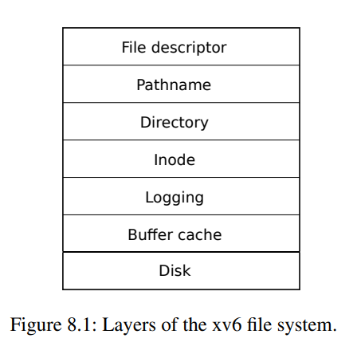
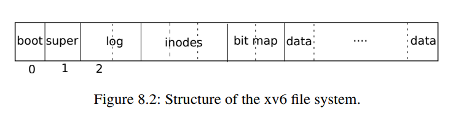
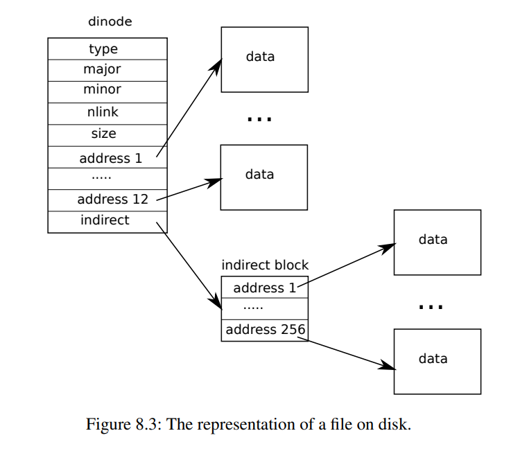

# Chpater 8

# 文件系统

文件系统的目的是组织和存储数据。文件系统通常支持数据在用户和应用程序之间的共享，并具有持久性，使得在重新启动后数据仍然可用。

xv6文件系统提供类Unix的文件、目录和路径名（参见第1章），并将其数据存储在virtio磁盘上以保持持久性。文件系统解决了几个挑战：

1. 文件系统需要在磁盘上的数据结构来表示具有名称的目录和文件结构树，记录保存每个文件内容的块的身份，以及记录磁盘上哪些区域是空闲的。
2. 文件系统必须支持崩溃恢复。也就是说，如果发生崩溃（例如断电），则文件系统必须在重新启动后仍然能够正确地工作。风险在于崩溃可能会中断一系列更新，并在磁盘上留下不一致的数据结构（例如，既在文件中使用又被标记为空闲的块）。
3. 不同的进程可能同时操作文件系统，因此文件系统代码必须协调来维护不变量。
4. 访问磁盘比访问内存慢几个数量级，因此文件系统必须维护内存中流行块的缓存。

本章的其余部分将解释xv6如何解决这些问题。

## 概述
xv6文件系统实现分为七个层，如图8.1 所示。磁盘层读写virtio硬盘上的块。缓冲区层缓存磁盘块并同步对它们的访问，确保每次只有一个内核进程可以修改任何特定块中存储的数据。日志层允许更高层将对多个块的更新包装在一个事务中，并确保在崩溃的情况下原子地更新这些块（即，所有块都被更新或者都没有更新）。inode层提供单个文件，每个文件表示为一个inode，具有唯一的i编号和一些保存文件数据的块。目录层将每个目录实现为一种特殊类型的inode，其内容是一系列目录条目，每个目录条目都包含文件的名称和i编号。路径名层提供分层路径名，例如`/usr/rtm/xv6/fs.c`，并使用递归查找解析它们。文件描述符层抽象出许多Unix资源（例如，管道、设备、文件等），使用文件系统接口，简化应用程序程序员的生活。



传统上，磁盘硬件将磁盘上的数据呈现为一系列512字节的编号**块**(也称为**扇区**)：扇区0是前512字节，扇区1是其后续，以此类推。操作系统用于其文件系统的块大小可能与磁盘使用的扇区大小不同，但通常块大小是扇区大小的倍数。 XV6将其已读取到内存中的块的副本保存在`struct buf`类型的对象中。此结构中存储的数据有时与磁盘不同步：它可能尚未从磁盘中读取（磁盘在处理它，但尚未返回扇区的内容），或者可能已由软件更新但尚未写入磁盘。

文件系统必须有一个计划，即存储在磁盘上的inode和内容块的位置。为此，xv6将磁盘分成几个部分，如图8.2所示。文件系统不使用块0（它保存引导扇区）。块1被称为**超级块**，它包含有关文件系统的元数据（文件系统大小（以块为单位），数据块的数量，inode的数量以及日志中块的数量）。块2开始保存日志。日志之后是inode，每个块多个inode。之后是跟踪哪些数据块正在使用的位图块。剩余的块是数据块，每个数据块都标记为空闲或包含文件或目录的内容。超级块由一个名为`mkfs`的单独程序填充，该程序构建初始文件系统。

本章的其余部分讨论了每个层，从缓冲区高速缓存开始。注意在较低层选择的精心设计的抽象何以减轻更高层的设计。

## 缓冲缓存层

缓冲缓存层(Buffer cache layer)有两个任务：（1）同步访问磁盘块，以确保只有一个块的副本在内存中，并且同一时间只有一个内核线程使用该副本；（2）高速缓存常用块，以避免从缓慢的磁盘中再次读取这些块。相关代码在`bio.c`里面。

缓冲缓存层导出的主要接口包括`bread`和`bwrite`，前者获取包含块副本的\indextext{buf}，在内存中可以读或修改，后者将修改后的缓冲区写入相应的磁盘块。内核线程必须通过调用`brelse`来释放缓冲区。

为了确保每个线程同时只使用一个缓冲区（以及因此每个磁盘块），缓冲缓存层使用每个缓冲区独有的睡眠锁；`bread`返回一个锁定的缓冲区，而`brelse`则释放锁。

接下来，我们回到缓冲缓存层。缓冲缓存层具有一定数量的缓冲区来保存磁盘块，这意味着如果文件系统请求一个尚未在缓存中的块，则缓冲缓存层必须回收当前保存其他块的缓冲区。缓冲缓存层通过回收最近最少使用的缓冲区来为新块腾出空间。这种做法的假设是最近最少使用的缓冲区最不可能很快再次使用。



## 代码:Buffer cache

缓冲缓存层是一个双向链表，用于存放缓存区域缓存的数据块。函数`binit`在`main`中被调用来初始化具有`NBUF`缓存区的静态数组`buf`。所有其他对缓冲区的访问都是通过`bcache.head`引用链表，而不是通过`buf`数组。

每个缓冲区有两个状态字段: `valid`表示缓冲区包含块的副本。字段`disk`表示缓冲区内容已经传递给磁盘，这可能会更改缓冲区（例如，将数据从磁盘写入`data`中）。

`bread`调用`bget`来获取给定扇区的缓冲区。如果需要从磁盘中读取缓冲区，则在返回缓冲区之前，`bread`调用`virtio_disk_rw`来执行该操作。

`bget`扫描缓冲区链表，搜索具有给定设备和扇区号的缓冲区。如果找到这样的缓冲区，`bget`获取该缓冲区的睡眠锁，然后返回该已锁定的缓冲区。

如果没有缓存该扇区的缓冲区，则`bget`必须创建一个，可能会重复使用保存不同扇区的缓冲区。它第二次扫描缓冲区链表，查找未使用的缓冲区（`b->refcnt = 0`）; 可以使用任何这样的缓冲区。它编辑缓冲区元数据以记录新的设备和扇区号，并获取其睡眠锁。请注意，分配`b->valid = 0`确保`bread`将从磁盘读取块数据，而不是错误地使用缓冲区的前一个内容。

保证每个磁盘扇区最多有一个缓存的缓冲区非常重要，以确保读者看到写入，并且因为文件系统使用缓冲区上的锁进行同步。`bget`通过从第一个循环检查块是否已缓存到第二个循环声明块已被缓存（通过设置`dev`、`blockno`和`refcnt`）来保证此不变量。这导致对区块存在性的检查（如果不存在）和指定缓冲区来保存块的检查是原子的。

因为非零`b->refcnt`防止缓冲区被重新用于不同的磁盘块，所以`bget`可以在`bcache.lock`临界区之外获取缓冲区的睡眠锁。睡眠锁保护块缓存内容的读取和写入，而`bcache.lock`保护有关缓存块的信息。

如果所有缓冲区都忙，则同时执行文件系统调用的进程太多，`bget`会出现故障。更优雅的响应可能是等待缓冲区空闲，虽然那样会有死锁的可能性。

一旦`bread`已经从磁盘读取（如果需要）并将缓冲区返回给调用者，调用者就可以独占该缓冲区并读取或写入数据字节。如果调用者修改缓冲区，它必须在释放缓冲区之前调用`bwrite`将更改后的数据写入磁盘。`bwrite`调用`virtio_disk_rw`与磁盘硬件通信。

当调用者完成使用缓冲区时，必须调用`brelse`释放它。缩写为b-release的`brelse`虽然不易被理解，但还是值得学习的: 它起源于Unix，并在BSD、Linux和Solaris中也使用。释放睡眠锁并将缓冲区移动到链表的前面。移动缓冲区导致链表按最近使用（释放）的时间排序：链表中的第一个缓冲区是最近使用的，最后一个是最不常使用的。`bget`中的两个循环利用了这一点: 在最坏的情况下，寻找现有缓冲区的扫描必须处理整个列表，但从最近使用的缓冲区开始搜索（从`bcache.head`开始，然后遵循`next`指针）将减少扫描时间，当存在良好的参考局部性时。选择要重用的缓冲区的扫描通过向后扫描（按照`prev`指针排列）来选择最近最少使用的缓冲区。

## 日志层(Logging layer)

文件系统设计中最有趣的问题之一是崩溃恢复。这是因为许多文件系统操作涉及多次写入磁盘，而在部分写入后崩溃可能会导致磁盘上的文件系统处于不一致的状态。例如，假设在文件截断期间（将文件长度设置为零并释放其内容块）发生了崩溃。根据磁盘写入的顺序，崩溃可能会使inode具有引用被标记为空闲的内容块，或者可能会使分配但未引用的内容块保留在磁盘上。

后者相对无害，但引用已释放块的inode在重启后可能会导致严重问题。重启后，内核可能会将该块分配给另一个文件，现在我们有两个不同的文件意外指向同一个块。如果xv6支持多个用户，则这种情况可能会成为安全问题，因为旧文件的所有者将能够读取和写入由不同用户拥有的新文件中的块。

Xv6通过使用简单的日志记录解决了文件系统操作期间的崩溃问题。一个xv6系统调用不会直接写入磁盘上的文件系统数据结构。相反，它将希望进行的所有磁盘写入的描述放在磁盘上的日志中。一旦系统调用记录了它的所有写入操作，它便会向磁盘写入一个特殊的提交记录，指示该日志包含完整的操作。此时，系统调用将写入复制到磁盘上的文件系统数据结构。在这些写入完成之后，系统调用会删除磁盘上的日志。

如果系统崩溃并重启，则文件系统代码会首先在运行任何进程之前按以下方式从崩溃中恢复。如果将日志标记为包含完整的操作，则恢复代码将将写入操作复制到它们在磁盘上属于的位置。如果日志未标记为包含完整的操作，则恢复代码将忽略该日志。恢复代码最后会删除日志。

为什么xv6的日志能够解决文件系统操作期间的崩溃问题？如果在操作提交之前发生崩溃，则磁盘上的日志不会被标记为完整，恢复代码将忽略它，磁盘的状态就像该操作甚至没有开始一样。如果在操作提交后发生崩溃，则恢复将重播所有操作的写入，如果该操作已经开始将它们写入磁盘数据结构，可能会重复它们。无论哪种情况，日志使操作在崩溃方面是原子性的，恢复后，操作的所有写入都将出现在磁盘上，或者根本不会出现。

## Log design

日志位于已知的固定位置，指定在超级块中。它由一个头块和一个更新块副本序列（“已记录块”）组成。头块包含一个扇区号数组，一对应于每个已记录块，以及日志块的计数。磁盘上头块中的计数为零，表示日志中没有事务，或非零，表示日志包含已提交的完整事务，且有所记录的块数。Xv6在事务提交时写入头块，但不是在事务提交之前，并在将已记录块复制到文件系统后将计数设置为零。因此，在事务中途崩溃将导致日志头块中的计数为零；在提交后崩溃将导致计数为非零。

每个系统调用的代码指示必须原子化写入序列的开始和结束，以避免在崩溃方面产生问题。为了允许不同进程之间并发执行文件系统操作，日志系统可以将多个系统调用的写入累计到一个事务中。因此，单个提交可以涉及多个完整系统调用的写入。为了避免将系统调用拆分成多个事务，日志系统仅在没有文件系统系统调用正在进行时提交。

将几个事务一起提交的想法称为组提交。组提交减少了磁盘操作的数量，因为它将提交的固定成本摊分到多个操作上。组提交还将多个并发写操作同时提交给磁盘系统，可能允许磁盘在单个磁盘旋转期间写入所有操作。Xv6的virtio驱动程序不支持这种批处理，但xv6的文件系统设计可以支持它。

Xv6在磁盘上分配一定量的固定空间来保存日志。系统调用写入的所有块的总数必须适合该空间。这有两个后果。不允许单个系统调用写入比日志中的空间更多的不同块。对于大多数系统调用，这不是问题，但其中两个可能会写入许多块：write和unlink。大文件写入可能会写入许多数据块和位图块以及一个inode块；解除链接大文件可能会写入许多位图块和一个inode。Xv6的写入系统调用将大写拆分为多个适合日志中的小写，而unlink不会引起问题，因为实际上xv6文件系统仅使用一个位图块。日志空间有限的另一个后果是，日志系统不能允许系统调用启动，除非它确定系统调用的写入将适合日志中剩余的空间中。

## Code: logging

一个系统调用中典型的日志使用方法如下：
```C
begin_op();
...
bp = bread(...);
bp->data[...] = ...;
log_write(bp);
...
end_op();
```

`begin_op`会等待到日志系统当前没有在执行提交操作，并且有足够的未预留的存储空间以便存储本次调用的写操作。 `log.outstanding` 计数器用来统计已经预留了日志存储空间的系统调用次数，总的预留空间为 `log.outstanding` 倍的 `MAXOPBLOCKS`。递增 `log.outstanding` 既会预留空间，也会阻止在此系统调用期间发生提交操作。代码保守地假设每个系统调用可能最多写入 `MAXOPBLOCKS` 个不同的块。

`log_write`充当 `bwrite`的代理，它在内存中记录了块的扇区号，为它在磁盘日志上预留了一个槽位，并将缓冲区中的块固定在块缓存中，以防块缓存将其驱逐。该块必须保留在缓存中直到提交为止。在此期间，缓存中的副本是修改的唯一记录。在提交之前，写入其磁盘位置的副本无法写入，并且同一事务中的其他读取必须看到修改。 `log_write`会注意到一个块在单个事务中被多次写入，然后会为该块分配在日志中的相同槽。

`end_op`首先递减等待提交的系统调用计数器。如果计数器现在为零，则通过调用 `commit()` 提交当前的事务。此过程包括四个阶段：`write_log()` 将事务中所有被修改的块从缓存中复制到磁盘日志上的对应槽位中。 `write_head()` 将事务标识信息的头部块写入磁盘：这是提交点，如果在写入后发生崩溃，将通过日志恢复将事务修改重放至文件系统中。 `install_trans` 从日志中读取每块数据，并将其写入文件系统中适当的位置。最后，`end_op` 会将日志头部中的计数器清零，这必须在下一次事务开始写入日志块之前完成，以防止在崩溃情况下，日志恢复操作使用一次事务的头部，但是在后续事务的已记录块中继续恢复操作。

`recover_from_log` 被 `initlog` 调用，它读取日志头部，并在头部指示存在已提交的事务时按照 `end_op` 的操作来执行。

`filewrite` 是日志使用的一个案例，该事务如下：
```
        begin_op();
        ilock(f->ip);
        r = writei(f->ip, ...);
        iunlock(f->ip);
        end_op();
```
该代码被包装在一个循环中，将大写操作分解成只有几个扇区的单个事务，以避免溢出日志。调用 `writei` 会在此事务中写入许多块：文件的 inode、一个或多个位图块和一些数据块。

## Code: 块分配器(Block allocator)

文件和目录内容存储在磁盘块中，这些块必须从空闲池中分配。Xv6的块分配器在磁盘上维护一个空闲位图，每块对应一个位。一个零位表示相应的块为空闲的，一个一位表示该块正在使用中。程序 `mkfs` 会设置引导扇区、超级块、日志块、inode 块和位图块对应的位。

块分配器提供两个函数：`balloc` 分配一个新的磁盘块，`bfree` 将块释放。 `balloc` 中的循环将从块0开始，直到文件系统中的块数 `sb.size`，考虑每个块，然后查找位图位为零的块，表示它是空闲的。如果 `balloc` 找到这样的块，它会更新位图并返回块。为提高效率，循环分为两个部分。外循环会读取每个位图块。内循环检查单个位图块中所有 `BPB`(Bits-Per-Block) 个位。如果两个进程尝试同时分配一个块，可能会发生竞争，但是缓冲缓存层只允许一个进程同时使用一个位图块，因此不需要 明确的锁定。

`bfree` 会查找正确的位图块并清除正确的位。同样，由 `bread` 和 `brelse` 隐含的互斥使用避免了需要显式锁定的问题。

与本章剩余的大部分代码一样，`balloc` 和 `bfree` 必须在事务内调用。

## 索引节点层(Inode layer)

术语inode可能有两个相关含义。它可能指代磁盘上的数据结构，其中包含文件的大小和数据块编号列表。或者，“inode”可能指的是内存中的inode，其中包含磁盘上inode的副本以及内核中需要的额外信息。

磁盘上的inodes被打包成一个连续的区域，称为inode块。每个inode的大小相同，因此，给定一个编号n，可以轻松地在磁盘上找到第n个inode。实际上，这个编号n，称为inode编号或i-number，是inode在实现中的标识。

磁盘上的inode由一个名为`struct dinode`的类型定义。type字段区分文件、目录和特殊文件（设备）。类型为零表示磁盘上的inode是空闲的。`nlink`字段计算引用该inode的目录项数，以便在磁盘inode及其数据块应被释放时识别。`size`字段记录文件内容的字节数。`addrs`数组记录持有文件内容的磁盘块的块号。

内核在内存中保留一张名为`itable`的表，其中包含活动的inodes。`struct inode`是磁盘上`struct dinode`的内存副本。内核只在存在指向该inode的C指针时才将inode存储在内存中。ref字段计算引用内存inode的C指针数，如果引用计数降至零，则内核会从内存中丢弃inode。`iget`和`iput`函数获取和释放指向inode的指针，修改引用计数。文件描述符、当前工作目录和transient内核代码（如`exec`）可以提供inode的指针。

xv6 inode代码中有四个锁或类似锁的机制。`itable.lock`保护了一个inode在inode表中最多出现一次的不变性，以及内存中inode的`ref`字段计数内存指向inode的指针的不变性。每个内存inode都有一个lock字段，其中包含一个`sleep-lock`，它确保对inode的字段（如文件长度）以及inode的文件或目录内容块的排他访问。inode的`ref`（如果它大于零）会导致系统将inode保留在表中，并且不会将表条目用于其他inode。最后，每个inode都包含一个`nlink`字段（在磁盘上和在内存中复制），它计算指向文件的目录项数；如果它的链接计数大于零，xv6将不会释放该inode。

由`iget()`返回的`struct inode`指针保证在相应的`iput()`调用之前有效；inode不会被删除，并且指针引用的内存不会被用于其他inode。`iget()`提供对inode的非独占访问，以便可以存在许多指向同一inode的指针。文件系统代码的许多部分依赖于`iget()`的这种行为，既用于持有inode的长期引用（如打开的文件和当前目录），也用于在操作多个inode（如路径名查找）的代码中避免竟态，同时又避免死锁。

由`iget()`返回的`struct inode`可能没有任何有用内容。为了确保它持有磁盘上inode的副本，代码必须调用ilock。这会锁定inode（以便其他进程无法`ilock`它）并从磁盘读取inode（如果尚未读取）。`iunlock`释放对inode的锁定。将inode指针的获取与锁定分开有助于避免某些情况下的死锁，例如在目录查找期间。多个进程可以持有由iget返回的C指针指向的inode，但是一次只有一个进程可以锁定inode。

inode表仅存储内核代码或数据结构持有C指针的inode。inode表的主要工作是同步多个进程的访问。inode表还偶然缓存频繁使用的inodes，但缓存是次要的；如果inode经常使用，则缓冲缓存层可能会将其保留在内存中。修改内存中的inode的代码使用`iupdate`将其写入磁盘。

## Code:Inodes

当需要分配新 inode（例如，创建文件时），xv6 调用 `ialloc`。与 `balloc` 类似，`ialloc` 在磁盘上逐块地遍历 inode 结构，找到标记为空闲的 inode。找到后，`ialloc` 通过将新的 `type` 写入磁盘并返回 inode 表中的一个条目来占用它，接着使用回调函数 `iget`。`ialloc` 的正确操作取决于只有同时只有一个进程可以持有对 `bp` 的引用：`ialloc` 可以确保其他进程不会同时看到 inode 可用并尝试占用它。

`iget` 在 inode 表中查找具有所需设备和 inode 号的活动条目(`ip->ref > 0`)。如果找到，它返回对该 inode 的新引用。在扫描时，`iget` 记录第一个空隙的位置，如果需要分配表条目，则使用该位置。在读取或写入元数据或内容之前，代码必须使用 `ilock` 锁定 inode。`ilock` 用于此目的的是睡眠锁。一旦 `ilock` 独占 inode，如果需要，它会从磁盘（更可能是缓冲缓存层）读取 inode。函数 `iunlock` 释放睡眠锁，这可能会唤醒任何等待的进程。

`iput` 通过减少引用计数释放对 inode 的 C 指针。如果这是最后一个引用，则 inode 在 inode 表中的位置现在为空闲状态，并可以重新用于不同的 inode。如果 `iput` 发现没有 C 指针引用 inode，并且该 inode 没有任何链接（不出现在任何目录中），则必须释放 inode 及其数据块。`iput` 调用 `itrunc` 使文件截断为零字节，释放数据块；设置 inode 类型为 0（未分配）；并将 inode 写入磁盘。

`iput` 中释放 inode 的锁定协议值得更仔细地研究。一个危险是并发线程可能正在等待 `ilock` 来使用此 inode（例如，读取文件或列出目录），并且可能不准备发现 inode 不再分配。这不可能发生，因为如果具有没有指向它的链接且 `ip->ref` 为 1，则系统调用无法获取指向内存中的 inode 的指针。那个 1 的引用是调用 `iput` 的线程拥有的引用。的确，在 `itable.lock` 临界区之外，`iput` 检查引用计数是否为 1，但是此时已知链接计数为零，因此没有线程会尝试获取新引用。另一个主要危险是并发调用 `ialloc` 的线程可能选择要 `iput` 正在释放的 inode。只有在 `iupdate` 写入磁盘使 inode 具有类型零后，此种竞争才会发生。此种竞争是无害的；分配线程将有礼貌地等待占用 inode 的睡眠锁，然后在此时读取或写入 inode，此时 `iput` 已经完成操作。

`iput ()` 可以写入磁盘。这意味着使用文件系统的任何系统调用都可能写入磁盘，因为该系统调用可能是最后一个具有对该文件的引用。即使看起来只读的调用（如 `read()`）也可能调用 `iput()`。这反过来意味着，即使是只读的系统调用也必须在使用文件系统时包装在事务中。

`iput()` 与崩溃之间存在一个具有挑战性的交互。当文件的链接计数降至零时，`iput()` 不会立即截断文件，因为某个进程可能仍然在内存中持有 inode 的引用：该进程仍然可以读取和写入文件，因为它已经成功打开了它。但是，如果在最后一个进程关闭文件描述符之前发生崩溃，则文件将在磁盘上被标记为已分配，但没有任何目录条目指向它。

文件系统通过以下两种方式处理此情况。简单的解决方案是，在恢复后，重新启动时，文件系统扫描整个文件系统以查找标记为已分配但没有目录条目指向它们的文件。如果存在任何这样的文件，则可以释放这些文件。

第二种解决方案不需要扫描文件系统。在此解决方案中，文件系统在磁盘上（例如，在超级块中）记录其链接计数降至零但引用计数不为零的 inode 的 inode 编号。如果文件系统在其引用计数达到 0 时删除文件，则通过从列表中删除该 inode 更新磁盘上的列表。在恢复后，文件系统释放列表中的任何文件。

xv6 实现了这两种方案，这意味着即使不再使用，inode 也可能被标记为已分配在磁盘上。这意味着随着时间的推移，xv6 存在磁盘空间不足的风险。

## Code : Inode content



磁盘上的 inode 结构体 `struct dinode` 包含了文件大小和一个块号数组（见图8.3）。 inode 数据可以在 `dinode` 的 `addrs` 数组中找到。 数据的前 `NDIRECT` 块被列在数组的前 `NDIRECT` 个条目中，这些块被称为直接块。 接下来的 `NINDIRECT` 块数据不是列在 inode 中，而是列在一个称为间接块的数据块中。 `addrs` 数组的最后一个条目给出了间接块的地址。 因此，文件的前 12 kB（$NDIRECT \times BSIZE$）字节可以从 inode 中列出的块中加载，而接下来的 256 kB（$NINDIRECT \times BSIZE$）字节只能在咨询间接块后才能加载。 这是一个很好的磁盘表示形式，但对于客户端来说很复杂。 函数 `bmap` 处理这个表示形式，使得高级例程（例如接下来我们将看到的 `readi` 和 `writei`）不需要处理这种复杂性。 `bmap` 返回 inode `ip` 的第 `bn` 个数据块的磁盘块号。 如果 `ip` 没有这样的块，`bmap` 将会分配一个块。

函数 `bmap` 首先处理比较简单的情况：inode 中列出的前 `NDIRECT` 块。 后 `NINDIRECT` 块列在 inode 中的 offset 为 `NDIRECT` 的条目中。 `bmap` 读取间接块，然后从块中正确的位置读取块号。 如果块号超过了 `NDIRECT+NINDIRECT`，`bmap` 会 panic；`writei` 中包含了防止这种情况发生的检查。

`bmap` 根据需要分配块。 零值的 `ip->addrs[]` 或间接条目表明没有分配块。 当 `bmap` 遇到零值时，它会分配新块号，并用它替换零值。

`itrunc` 释放文件的块，将 inode 的大小重置为零。 `itrunc` 首先释放直接块，然后是列在间接块中的块，最后是间接块本身。

函数 `bmap` 使 `readi` 和 `writei` 更容易获取 inode 的数据。 `readi` 首先确保偏移量和数据长度不超出文件的结尾。 开始于文件结尾之后的读取会返回一个错误，而开始于文件结尾或交叉于文件结尾的读取会返回较少字节的数据。 主循环处理文件的每个块，将数据从缓冲区复制到 `dst` 中。 `writei` 和 `readi` 是相同的，有三个例外：开始于文件结尾或交叉于文件结尾的写入会增加文件大小，直到达到最大文件大小，循环将数据复制到缓冲区而不是从缓冲区复制出来，如果写操作扩展了文件，则`writei` 必须更新其大小。

函数 `stati` 将 inode 元数据复制到 `stat` 结构中，该结构通过系统调用 `stat` 提供给用户程序。

## Code:目录层(directory layer)

目录在内部实现上非常类似于文件。 其 inode 的类型为 `T_DIR`，其数据是一个目录条目序列。 每个条目都是一个 `struct dirent`，其中包含了名称和 inode 号。 名称最多有 DIRSIZ（14）个字符；如果较短，则以空字符（0）中止。 inode 号为零的目录条目是空闲的。

函数 `dirlookup` 在目录中查找指定名称的条目。 如果找到了，它会返回相应的未锁定 inode 的指针，并将 `poff` 设置为该目录条目的字节偏移量，以便调用者可以进行编辑。 如果 `dirlookup` 找到了名称正确的条目，则更新 `poff` 并返回由 `iget` 获取的未锁定 inode。 `dirlookup` 是 `iget` 返回未锁定 inode 的原因。 调用者已经锁定了 `dp`，因此如果查找是针对 `.`，表示当前目录的别名，则在返回之前尝试锁定 inode 会重新锁定 `dp` 并死锁。 （包括多个进程和 `..`，表示父目录的别名，存在更复杂的死锁场景；`.` 不是唯一的问题。） 调用者可以解锁 `dp`，然后锁定 `ip`，确保一次只持有一个锁。

函数 `dirlink` 在目录 `dp` 中写入一个具有给定名称和 inode 号的新目录项。 如果名称已经存在，`dirlink` 将返回错误。 主循环读取目录条目，寻找未分配的条目。 找到一个条目后，它会提前停止循环，并将 `off` 设置为可用条目的偏移量。 否则，循环结束时 `off` 被设置为 `dp->size`。 无论哪种情况，`dirlink` 都会通过写入偏移量 `off` 来向目录添加一个新条目。

## Code:路径名(Path names)

路径名查找(Path name lookup)是指对每个路径组件调用一次`dirlookup`，对于`namei`，它会计算`path`，并返回对应的`inode`。而函数`nameiparent`则停留在最后一个元素前，返回父目录的inode，并将最后一个元素复制到`name`中。这两个函数都调用了通用的函数`namex`来实现实际的功能。

`namex`会通过判断路径从哪开始进行评估。如果路径以斜杠开头，则从根开始评估；否则，从当前目录开始。然后它使用`skipelem`来逐个考虑路径的每个元素。每个循环迭代都必须在当前inode`ip`中查找`name`。循环迭代从锁定`ip`并检查它是否为目录开始。如果不是，则查找会失败(Locking `ip`是必要的，不是因为`ip->type`可能会在查找过程中改变，而是因为在`ilock`运行之前，不保证`ip->type`已经从磁盘中加载)。如果调用是`nameiparent`并且这是最后的路径元素，则循环提前停止，根据`nameiparent`的定义已经将最后一个路径元素复制到`name`中，因此`namex`只需要返回未锁定的`ip`。最后，循环在`dirlookup`中查找路径元素并准备下一次迭代，设置`ip = next`。当循环用完路径元素时，它返回`ip`。

过程`namex`可能需要很长时间才能完成：它可能涉及多次磁盘操作以读取节点和目录块，这些目录块都是沿路径遍历的(如果它们不在缓存中)。Xv6经过精心设计，使得如果一个内核线程调用`namex`时，被阻塞在磁盘I/O上，那么另一个内核线程查找不同的路径名时可以并发地进行。 `namex`会单独为路径中的每个目录加锁以便不同目录的查找可以并行进行。

并发性引入了一些挑战。例如，当一个内核线程在查找路径名时，另一个内核线程可能正在通过unlink删除一个目录，导致查找可能询问到已被删除的目录，同时该目录的块已被重用为其他目录或文件。

Xv6避免了这种竞争。例如，当在`namex`中执行`dirlookup`时，查找线程会在目录上持有锁，并使用`iget`获取一个inode(即`dirlookup`返回的inode)。`iget`增加了inode的引用计数。只有在从`dirlookup`接收到inode之后，`namex`才会释放目录的锁，这使得另一个线程可能会从目录中取消inode的链接，但由于inode的引用计数仍大于零，因此xv6不会立即删除inode。

另一个风险是死锁。例如，当查找"."目录时`next`指向与`ip`相同的inode。在锁定`next`之前释放`ip`上的锁将导致死锁。为了避免这种死锁，`namex`会在获得`next`的锁之前先释放目录的锁。这也再次说明为什么`iget`和`ilock`的分离非常重要。

## 文件描述层(File descriptor layer)

Unix接口的一个优美之处在于，Unix中的大部分资源都被表示为文件，包括控制台、管道以及当然还有真实的文件。文件描述符层是实现这种统一性的关键。

Xv6为每个进程提供了自己的打开文件表或文件描述符表，正如我们在第1章中看到的那样。每个打开的文件都由一个`struct file`表示，它是一个inode或管道的包装器，加上一个I/O偏移量。每次调用`open`都会创建一个新的打开文件（一个新的`struct` `file`）。如果多个进程独立地打开同一个文件，则不同的实例将具有不同的I/O偏移量。另一方面，单个打开文件（相同的`struct` `file`）可以出现在一个进程的文件表中多次，也可以在多个进程的文件表中出现多次。如果一个进程使用`open`打开文件，然后使用`dup`创建别名或使用`fork`与子进程共享它，则会发生这种情况。引用计数跟踪对特定打开文件的引用数。文件可以同时被打开以进行读取和写入，`readable`和`writable`字段跟踪此状态。

系统中所有打开的文件都被保存在全局文件表（`ftable`）中，文件表具有分配文件的函数（`filealloc`）、创建重复引用（`filedup`）、释放引用（`fileclose`）、以及读写数据的功能（`fileread`和`filewrite`）。

前三个函数遵循现在熟悉的形式。`filealloc`扫描文件表以查找未引用的文件（`f->ref` `==` `0`），并返回一个新引用；`filedup`增加引用计数；`fileclose`则对其进行减少。当文件的引用计数达到零时，`fileclose`会根据其类型释放底层管道或inode。

函数`filestat`、`fileread`和`filewrite`实现了文件的`stat`、`read`和`write`操作。`filestat`只允许在inode上进行，并调用`stati`。`fileread`和`filewrite`检查打开模式是否允许此操作，然后将调用传递到管道或inode实现。如果文件表示为inode，则`fileread`和`filewrite`使用I/O偏移量作为操作的偏移量，然后将其递增。管道没有偏移量的概念。回想一下，inode函数要求调用方处理锁定问题。inode锁定具有方便的副作用，即读取和写入偏移量原子更新，因此多个同时写入同一文件的写操作不能覆盖彼此的数据，虽然它们的写入可能最终交织在一起。

## Code:系统调用(system calls)

利用底层提供的函数，大多数系统调用的实现都是非常简单的(详见(kernel/sysfile.c))。 然而有一些调用需要仔细研究。

`sys_link`和`sys_unlink`在目录中创建或删除inode的引用，是另一个使用事务的好例子。 `sys_link`首先获取两个字符串参数`old`和`new`。 假设`old`存在且不是目录，`sys_link`会增加`ip->nlink`的数量。 然后，`sys_link`调用`nameiparent`查找`new`的父目录和最终路径元素， 并创建一个新的目录项指向`old`的inode。 新的父目录必须存在于相同的设备上，并且在已存在的inode上仅具有唯一性。 如果出现此类错误，则`sys_link`必须返回并减少`ip->nlink`。

事务使得实现变得简单，因为需要更新多个磁盘块，但是我们不必担心更新它们的顺序，它会全部成功或全部失败。 例如，如果没有使用事务，在创建链接之前更新`ip->nlink`，会让文件系统暂时处于不安全的状态， 并且在中间崩溃可能会造成混乱。有了事务，我们就不必担心这个了。

`sys_link`为现有inode创建一个新名称。函数`create`则为新inode创建一个新名称。 这是三个文件创建系统调用的概括：`open`与`O_CREATE`标志一起创建一个新的普通文件， `mkdir`创建一个新目录，`mkdev`创建一个新的设备文件。 与`sys_link`一样，`create`首先调用`nameiparent`以获取父目录的inode， 然后调用`dirlookup`来检查名称是否已经存在。如果名称已经存在，则取决于使用`create` 的是哪个系统调用：`open`具有与`mkdir`和`mkdev`不同的语义。 如果`create`代表`open`(`type` `==` `T_FILE`)并且存在的名称本身是一个常规文件， 那么`open`将其视为成功，则`create`也会这样做。 否则，就会产生一个错误。如果名称不存在，`create`现在将使用`ialloc`分配一个新的inode。 如果新的inode是一个目录，则`create`使用`.`和`..`条目初始化它。 最后，现在数据已正确初始化，`create`可以将其链接到父目录中。 就像`sys_link`一样，`create`同时持有两个inode的锁：`ip`和`dp`。 不存在死锁的可能性，因为inode`ip`是刚刚被分配的，系统中没有其他进程持有它的锁并尝试锁定`dp`。

使用`create`，实现`sys_open`、`sys_mkdir`和`sys_mknod`就变得容易多了。 `sys_open`是最复杂的，因为创建新文件只是它的一小部分功能。 如果`open`被传递`O_CREATE`标志，则调用`create`。否则，它调用`namei`。 `create`返回一个锁定的inode，但`namei`不返回，所以`sys_open`必须自行锁定inode。 这提供了一个方便的地方来检查只有读取才可以打开目录。 假设inode已经通过某种方式获得，`sys_open`会分配一个文件和一个文件描述符，并填写文件。 请注意，由于它只存在于当前进程表中，因此没有其他进程可以访问部分初始化的文件。

第7章在我们甚至没有文件系统之前就研究了管道的实现。 `sys_pipe`函数通过提供一种创建管道对的方法，将其与文件系统连接起来。 它的参数是指向两个整数空间的指针，其中它将记录两个新的文件描述符。 然后它分配管道并安装文件描述符。

## 实际情况

在实际情况的操作系统中，缓冲池比xv6更为复杂，但是它们具有相同的两个目的：缓存和同步访问磁盘。xv6的缓冲池和V6的缓冲池一样，使用简单的最近最少使用（LRU）算法进行驱逐操作。有许多复杂的策略可以实现，每个策略对一些工作负载很好，对其他工作负载不太好。更有效的LRU缓存可以消除链表，而是使用哈希表进行查找，并使用堆进行最近最少使用的驱逐。现代缓冲池通常与虚拟内存系统集成，以支持内存映射文件。

xv6的日志系统效率低下。提交操作与文件系统系统调用无法并发进行。即使只更改了块中的少量字节，该系统也会记录整个块。它会进行同步日志写操作，每次写操作一个块，这很可能需要整个磁盘旋转时间。实际的日志记录系统解决了所有这些问题。

日志记录并不是提供紧急恢复的唯一方法。早期文件系统在重新启动时使用清道夫（例如UNIX的 `fsck`程序）检查每个文件和目录以及块和inode空闲列表，查找并解决不一致性。对于大型文件系统，清理可能需要几个小时，而且有些情况下不可能以一种使原始系统调用具有原子性的方式解决不一致性。相比之下，从日志进行恢复更快，并且可以使系统调用在面对崩溃时具有原子性。

xv6使用与早期UNIX相同的inode和目录磁盘布局；多年来，这种方案一直相当持久。BSD的UFS/FFS和Linux的ext2/ext3本质上使用相同的数据结构。文件系统布局中最低效的部分是目录，每次查找都需要在所有磁盘块上进行线性扫描。这在目录仅有几个磁盘块的情况下是合理的，但对于包含许多文件的目录来说，代价就很高了。微软Windows的NTFS、macOS的HFS和Solaris的ZFS等实现目录为磁盘上均衡树的文件系统，这是复杂的，但保证目录查找具有对数时间。

xv6对磁盘故障是相对简单的：如果磁盘操作失败，xv6会崩溃。这是否合理取决于硬件：如果操作系统位于使用冗余来屏蔽磁盘故障的特殊硬件之上，操作系统可能很少遇到故障，那么崩溃是可以接受的。另一方面，使用普通磁盘的操作系统应该预期故障并更加优雅地处理它们，以便一个文件中的一个块的损失不会影响对其余文件系统的使用。

xv6要求文件系统适合一个磁盘设备且无法更改大小。随着大型数据库和多媒体文件不断推动存储需求，操作系统正开发消除“每个文件系统一个磁盘”的瓶颈的方法。基本方法是将许多磁盘组合成单个逻辑磁盘。硬件解决方案，例如RAID，仍然是最受欢迎的，但当前趋势是尽可能地在软件中实现这些逻辑。这些软件实现通常允许丰富的功能，如通过添加或删除磁盘来增长或缩小逻辑设备。当然，可以随时增长或缩小的存储层需要一个可以做到同样的文件系统：xv6使用的inode块的固定大小数组在这些环境中无法正常工作。将磁盘管理与文件系统分开可能是最干净的设计，但两者之间的复杂接口已经导致一些系统，如Sun的ZFS，将它们组合在一起。

xv6的文件系统缺少许多现代文件系统的功能：例如，它不支持快照和增量备份。

现代Unix系统允许许多资源使用与磁盘存储相同的系统调用访问：命名管道、网络连接、远程访问的网络文件系统以及监视和控制接口，例如`/proc`。这些系统通常为每个打开的文件提供一个函数指针表，每种操作一个函数指针，并调用函数指针以调用inode的调用实现。网络文件系统和用户级文件系统提供将这些调用转换为网络RPC并等待响应的函数。

## 练习

1. 为什么在 `balloc` 中会 panic？xv6 能否恢复？
2. 为什么在 `ialloc` 中会 panic？xv6 能否恢复？
3. 当 `filealloc` 用尽文件时，为什么不会 panic？为什么这更常见，因此值得处理？
4. 假设另一个进程在 `sys_link` 对 `iunlock(ip)` 和 `dirlink` 调用之间取消了与 `ip` 相对应的文件，那么链接是否正确创建？为什么？
5. `create` 调用了四个函数（一个是 `ialloc`，三个是 `dirlink`），以使其成功执行。如果有任何一个失败了，`create` 将调用 `panic`。为什么这是可接受的？为什么这四个调用中的任何一个都不能失败？
6. 在 `sys_chdir` 调用 `iput(cp->cwd)` 之前调用了 `iunlock(ip)`，而 `iput` 可能尝试锁定 `cp->cwd`，但推迟 `iunlock(ip)` 直到 `iput` 之后不会导致死锁。为什么？
7. 实现 `lseek` 系统调用。支持 `lseek` 还需要修改 `filewrite`，以便在 `lseek` 将 `off` 设置为 `f->ip->size` 之外时，填充文件中的空洞为零。
8. 在 `open` 中添加 `O_TRUNC` 和 `O_APPEND`，以使 shell 中的 `>` 和 `>>` 运算符可用。
9. 修改文件系统以支持符号链接。
10. 修改文件系统以支持命名管道。
11. 修改文件和 VM 系统以支持内存映射文件